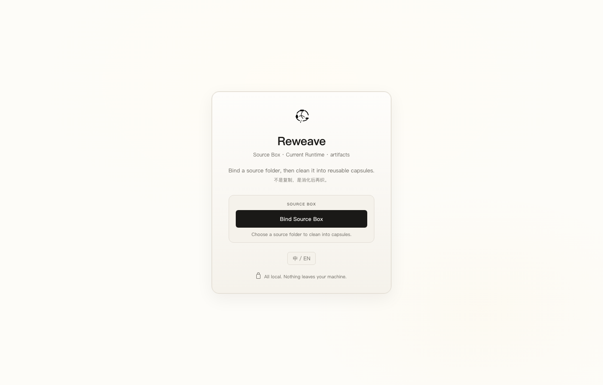
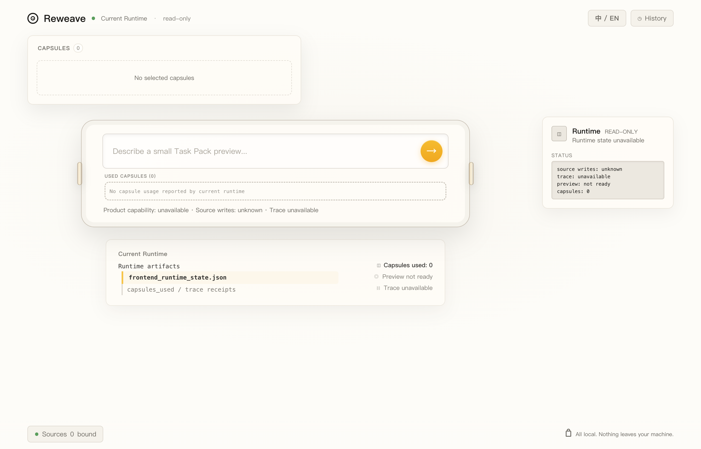

<div align="center">


# 再织 Reweave

**把旧项目清洗成可复用的胶囊，再织成新的 Web 任务包。**

旧项目 -> Source Box -> Capsules -> Task Pack -> New Web

[English](README.md)


</div>

## 30 秒 demo

```bash
python3 scripts/run_public_reweave_demo.py
ls /tmp/reweave_public_demo
```

预期输出包含 `task_pack.json`、`capsules_used.json` 和 `provenance.json`。

**边界：** 源项目默认只读。Reweave-lite 生成任务包 preview，不自动写入或覆盖你的项目。

## 为什么做

小模型不是完全不会写代码。它真正吃亏的地方，是很难稳定记住一个旧项目里的命名、布局、样式、业务词和细节规则。

再织把旧项目文件夹当作 **Source Box**，只读扫描后清洗成 **Capsule**，再让新任务按需调用这些胶囊，生成带来源痕迹的 **Task Pack Preview**。

它的灵感来自蜘蛛吐丝：旧项目里的线索不是被复制粘贴，而是被清洗、连接，再织成新的结构。

## 现在能做什么

- 绑定旧项目文件夹为 Source Box。
- 只读扫描，不写源项目。
- 生成 capsule candidate。
- 人工 Store 到本地 Capsule Warehouse。
- 在桌面工作台选择胶囊进入任务。
- 生成 Task Pack preview，包含：
  - `task_pack.json`
  - `capsules_used.json`
  - `provenance.json`
- 默认关闭真实源项目写入。

## 截图

### Source Box

绑定旧项目文件夹。它是胶囊来源，不是写入目标。



### Capsule Workbench

选择本地胶囊，规划新的 Web 任务，同时保留 trace 和 source-write 状态。



## 快速开始

运行公开 Task Pack demo：

```bash
python3 scripts/run_public_reweave_demo.py \
  --source examples/source_boxes/customer-quote-widget \
  --task "Build a quote summary card" \
  --out /tmp/reweave_public_demo
```

查看输出：

```bash
ls /tmp/reweave_public_demo
```

在桌面程序里试用公开 Source Box：

```text
examples/source_boxes/customer-quote-widget
examples/source_boxes/ops-status-card
```

运行公开仓库自带检查：

```bash
python3 -m pip install pytest
python3 -m pytest tests -q
node --check reweave_frontend/app.js
```

可选桌面壳：

```bash
./start_reweave_static.sh
```

可选 runtime bridge：

```bash
REWEAVE_LUMO_LITE_STATE_PATH=/path/to/frontend_runtime_state.json \
./start_reweave_static.sh
```

## 公开可复现性

- GitHub Actions 会运行 Reweave 测试。
- GitHub Actions 会运行公开 Task Pack demo。
- GitHub Actions 会检查 `task_pack.json`、`capsules_used.json` 和 `provenance.json`。
- GitHub Actions 会检查前端 JavaScript 语法。
- 默认启动不依赖私有工作区路径。
- Source project writes 默认保持关闭。

早期 Lumo Lite 工作台里的内部能力测试记录，不作为这个公开仓库的运行前提。

## 安全边界

再织现在不是全自动生产级 IDE。

它当前不承诺任意项目自动生成、不自动多文件写入、不覆盖文件、不删除文件，也不在前端开放真实写入按钮。

这个仓库公开的是旧项目复用链条里的 Reweave-lite 安全 release surface，不是全自动 IDE。

未来真实写入只保留一条安全路线：人工确认、单文件、新建、不覆盖、可回滚。

## 项目结构

```text
桌面界面                          reweave_frontend/
运行时桥接和预览引擎              Reweave engine modules
Source Box 入口和扫描             Source registry / scanner modules
胶囊草稿和仓库                    Capsule modules
Task Pack preview 和 provenance   Preview modules
公开 Source Box 样例              examples/source_boxes/
公开 Task Pack 复现脚本           scripts/run_public_reweave_demo.py
release 和 bridge 测试            tests/
```

Source Box -> Capsule -> Task Pack 的主链见 [Architecture](docs/ARCHITECTURE.md)。

## 后续方向

- 更多公开 Source Box demo。
- 更好的桌面打包。
- 更稳定的 Task Pack preview。

见 [Roadmap](ROADMAP.md)。

## 开源协议

MIT
