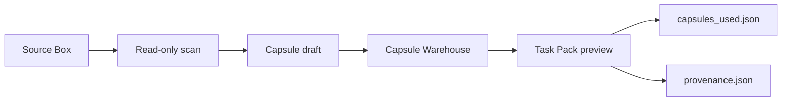

# Reweave-lite Architecture

Reweave-lite is a local, read-only old-project reuse path.

## Chain

- **Source Box**: an old project folder registered by path metadata.
- **Read-only scan**: directory summary only; no source file content read.
- **Capsule draft**: rule-based candidates from scan metadata.
- **Capsule Warehouse**: local app-state store for approved capsules.
- **Task Pack preview**: local preview output with capsule usage and provenance.

## Boundary

- Source project writes are off by default.
- No automatic multi-file apply.
- No overwrite or delete path in the public frontend.
- Public demos write only to the requested output directory.

## Runtime State

The desktop shell reads a bounded local runtime state file when one is provided through `REWEAVE_LUMO_LITE_STATE_PATH`.

Without that file, the public repo still runs the local demo path from `examples/source_boxes/` and writes preview output to the selected demo output directory.

## Privacy / Path Redaction

Public demo provenance redacts local source paths by default.

`provenance.json` stores:

- `path_policy: "redacted"`
- Source Box id and label

Use `--include-local-paths` only for local debugging output that will not be shared.
