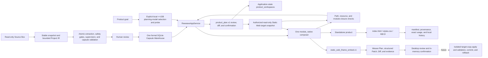

# Reweave-lite Architecture

Reweave is a local-first Static Web capability system with one formal SQLite
capsule warehouse, one `module_native` composer, and two delivery modes.

- The published baseline is `v0.3.0`, which closes Stage G.
- Current `main` additionally contains the completed legacy/North-Star
  calibration, the Static Web review-only Patch backend, and the desktop review
  interaction added by Plans 2–4. The current branch adds the formal local-model
  product-planning, confirmed-plan execution, and isolated-candidate backends.
- None of those post-tag capabilities were published by the existing `v0.3.0`
  Tag.

The authoritative roadmap is
[Reweave Product North Star](REWEAVE_PRODUCT_NORTH_STAR.md). Current behavior
and contracts are sealed in
[Reweave Capsule Ingestion Design](REWEAVE_CAPSULE_INGESTION_DESIGN.md) and the
linked acceptance records.

## One Core, Two Delivery Modes

```mermaid
flowchart LR
  A["Read-only Source Box"] --> B["Stable snapshot and bounded Project IR"]
  B --> C["Atomic extraction, safety gates, supervision, and capsule validation"]
  C --> D["Human review"]
  D --> E["One formal SQLite Capsule Warehouse"]
  E --> F["ReweaveAppService"]
  F --> G["One module_native composer"]

  P["Product goal"] --> Q["Explicit local <=15B planning-model selection and probe"]
  Q --> F
  F --> R["product_plan.v1 review, diff, and confirmation"]
  R --> S["Application-state product_workspaces"]
  R --> T["plan_execution.v1"]
  T --> G
  G --> U["isolated product_candidate.v1"]

  G --> H["Standalone product"]
  H --> I["index.html / styles.css / app.js"]
  I --> J["manifest, provenance, exact usage, and local history"]

  T["Authorized read-only Static Web target snapshot"] --> U["Path, resource, and module-closure checks"]
  U --> F
  G --> V["static_web_iframe_embed.v1"]
  V --> W["Weave Plan, structured Patch, Diff, and evidence"]
  W --> X["Desktop review and in-memory confirmation"]
  X -. "future" .-> Y["Isolated target-copy apply and validation, commit, and rollback"]
```

Both delivery modes consume eligible active-current immutable capsule versions
from the same warehouse and use the same composer. Target integration is not a
second repository, a second capsule format, or a second composition path.
Source Box binding metadata and transient target profiles do not form another
formal capsule warehouse.

`product_workspaces` is a separate application-state area for small structured
planning drafts, immutable confirmed plan versions, question/answer records,
plan Diffs, model-call evidence summaries, and confirmation receipts. It is not
a second Capsule IR, repository, product directory, or composer. It contains no
raw prompt, raw model response, capsule source, product source, or candidate
files. Isolated candidate files live under the separate application-state
`product_candidates` area; that area is not a formal product store.

## Shared Core

### Read-only intake and Project IR

Source projects are read through stable snapshots. The current narrow Project
IR consists of `projects`, `project_file_index`, snapshot evidence, and the
in-process `source_graph.v1`. It records only facts needed by the supported
Static Web and JavaScript capture paths; it is not a general repository model.

### Capsule IR and validation

The SQLite warehouse is the only formal Capsule IR. It owns capability groups,
capsules, immutable versions, contracts, scopes, sources, assets, status events,
validation evidence, product usage, backup, restore, and revalidation state.

Presentation, interaction, and computation candidates pass deterministic HTML,
CSS, JavaScript, asset, data-contract, sensitive-data, and brand gates. Local
Ollama supervision is explicit and bounded. Node-based capsule-validation,
image, and QWebEngine workers provide isolated runtime evidence; this is not
Node target integration. Models cannot relax rules, choose code boundaries,
create free-form adapters, or publish releases.

### Service and composer

`ReweaveAppService` is the shared product boundary. It loads eligible formal
versions and invokes the single `module_native` composer. The desktop bridge
forwards narrow service actions; it does not reproduce path, authorization,
composition, or Patch rules in the frontend.

The same service owns the product-planning actions. A separate logical local
planning-model role interprets goals, asks bounded blocking questions, plans
the fixed frontend/backend/data/infrastructure sections, and suggests opaque
candidate references. Deterministic code alone assigns plan/work-item IDs,
binds exact capsule/version identities, validates dependencies and eligibility,
computes canonical digests, persists workspaces, invalidates stale state, and
confirms plans. The planning role is independent from
`capsule_supervision_model`, even when a user selects the same installed model
for both roles.

## Product Planning Candidate (Not v0.3.0)

The desktop's single product-goal input now starts `product_plan.v1`. The first
use of an exact local Ollama name and digest requires explicit selection,
Ollama metadata proof of at most 15B actual parameters, and a strict Schema probe. There is no
automatic download, first-model selection, cloud call, or model fallback.

Planning is segmented into a bounded requirements outline, optional 1–3
blocking questions, four section calls, bounded code-free capsule-summary
batches, and deterministic final validation. The model never receives formal
capsule IDs, version IDs, canonical hashes, source paths, source code, SQLite
rows, product files, or absolute workspace paths; it can refer only to
ephemeral allowlisted candidate references.

The planning backend supports explanation, controlled `plan_diff` review,
confirmation, and history recovery. Confirmation writes only a structured plan
receipt after exact capsule revalidation. A separate explicit candidate action
can compile that receipt through `plan_execution.v1` and invoke `module_native`
once to create an isolated `product_candidate.v1`; it does not write the formal
product store or `product_capsule_usage`.

The deterministic planning backend, confirmed-plan compiler, isolated candidate
backend, and read-only thin reviewer pass their scoped gates. Local 7B evidence
proves planning drafts and bounded field suggestions, not reliable free-text
revision. A user-approved real strong-model goal-to-confirmed-plan run remains
outstanding, so the complete goal-to-candidate claim is `PARTIAL`.

## Delivery Mode 1: Standalone Product

The standalone path generates a new runnable `index.html`, `styles.css`, and
`app.js` product in Reweave application state. It records a manifest,
provenance, quality/runtime evidence, and exact capsule-version usage. Source
Boxes remain read-only.

The service-backed formal CLI accepts explicitly selected capsule IDs and uses
this same application-service and composer path. The retired Stage 4 public
demo is not an active product entry.

The legacy formal generation service remains available for compatibility and
existing product history. The new candidate backend is separate: it consumes a
confirmed plan, writes only isolated application state, and exposes no promote,
apply, commit, or rollback action.

## Delivery Mode 2: Static Web Target Review

The current target path supports one explicitly selected, build-free Static Web
entry. The backend:

- captures a stable, source-free target profile and snapshot digest;
- fails closed on path, symlink, Unicode/case collision, HTML resource, CSS,
  and local ES-module closure violations;
- accepts only `review_patch_only` authorization bound to the exact snapshot;
- invokes `module_native` once and maps its result through the fixed
  `static_web_iframe_embed.v1` strategy;
- returns a deterministic Weave Plan, complete structured Patch, text Diffs or
  binary metadata, provenance, validation evidence, and rejection reasons; and
- rechecks capsule eligibility and target stability before returning.

The desktop exposes a separate target-integration entry alongside standalone
generation. It provides simple/developer modes, eligible capsule cards, file
Diffs, binary metadata, validation/rejection evidence, and an in-memory review
receipt bound to `plan_id` and the target snapshot. Final confirmation makes no
bridge call and grants no write authority.

The target project, product store, warehouse revision, and
`product_capsule_usage` remain unchanged. The public CLI has no target-entry
command.

## Current Evidence Boundary

- The frozen local and corpus acceptance underlying the published `v0.3.0`
  baseline is recorded in
  [REWEAVE_STAGE_G_ACCEPTANCE.json](reports/REWEAVE_STAGE_G_ACCEPTANCE.json);
  hosted closure and the Tag are later publication facts.
- The real third-party Static Web target backend is recorded in
  [REWEAVE_STATIC_WEB_TARGET_PATCH_ACCEPTANCE.json](reports/REWEAVE_STATIC_WEB_TARGET_PATCH_ACCEPTANCE.json).
- The desktop review flow is recorded in
  [REWEAVE_STATIC_WEB_TARGET_UI_ACCEPTANCE.json](reports/REWEAVE_STATIC_WEB_TARGET_UI_ACCEPTANCE.json).
- The combined real-service, real-bridge, real-QWebEngine review-only proof is
  recorded in
  [REWEAVE_STATIC_WEB_TARGET_REAL_E2E_ACCEPTANCE.json](reports/REWEAVE_STATIC_WEB_TARGET_REAL_E2E_ACCEPTANCE.json).
- The product-planning implementation candidate, passing deterministic desktop
  regressions, and still-failing real 1.5B outline gate are recorded in
  [REWEAVE_PRODUCT_PLANNING_V1_ACCEPTANCE.json](reports/REWEAVE_PRODUCT_PLANNING_V1_ACCEPTANCE.json).

The earlier desktop acceptance intentionally froze the Plan 3 service contract
behind a strict protocol substitute. The later real E2E record closes the
combined `ReweaveAppService -> bridge -> QWebEngine` review-only flow without
changing the Patch, zero-write, or in-memory-confirmation boundary.

## Not Implemented

The current architecture does not provide:

- Patch application and validation in an isolated target copy, including target
  build, test, and post-Patch behavior checks;
- writes, apply, commit, or rollback in a user's real worktree;
- React + Vite or Node target integration;
- a formal desktop candidate reviewer or full IDE for confirmed product plans;
- candidate promotion into the formal product store, usage, or a user worktree;
- multi-capability large-product composition: the current `module_native`
  composer still accepts only 1–3 capsules from one capability group;
- a general Target Adapter, cross-project compatibility planner, or complete
  Project IR;
- automatic legal-license or distribution authorization; or
- automatic extraction of arbitrary external presentation/interaction code.

These are future stages. They must not be inferred from `v0.3.0`, current
mainline review-only support, CI status, or the in-memory review confirmation.

## Privacy and Paths

Local source paths are redacted from shareable provenance by default. The
target chooser may pass an absolute path to the backend for the current process,
but the target review frontend does not render, log, or persist that path.
