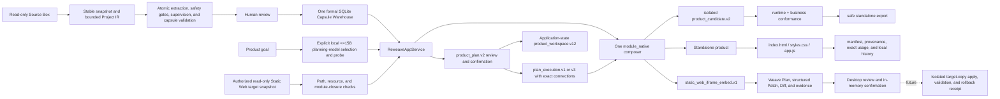

# Reweave-lite Architecture

Reweave is a local-first Static Web capability system with one formal SQLite
capsule warehouse, one `module_native` composer, and two delivery modes.

- The published baseline is `v0.3.0`, which closes Stage G.
- Current `main` additionally contains the completed legacy/North-Star
  calibration, the Static Web review-only Patch backend, and the desktop review
  interaction added by Plans 2–4. The current branch adds the formal local-model
  product-planning, confirmed-plan execution, and isolated-candidate backends.
- None of those post-tag capabilities were published by the existing `v0.3.0`
  Tag.

The authoritative roadmap is
[Reweave Product North Star](REWEAVE_PRODUCT_NORTH_STAR.md). Current behavior
and contracts are sealed in
[Reweave Capsule Ingestion Design](REWEAVE_CAPSULE_INGESTION_DESIGN.md) and the
linked acceptance records.

## One Core, Two Delivery Modes


```mermaid
flowchart LR
  A["Read-only Source Box"] --> B["Stable snapshot and bounded Project IR"]
  B --> C["Atomic extraction, safety gates, supervision, and capsule validation"]
  C --> D["Human review"]
  D --> E["One formal SQLite Capsule Warehouse"]
  E --> F["ReweaveAppService"]
  F --> G["One module_native composer"]

  P["Product goal"] --> Q["Explicit local <=15B planning-model selection and probe"]
  Q --> F
  F --> R["product_plan.v2 review and confirmation"]
  R --> S["Application-state product_workspace.v12"]
  R --> T["plan_execution.v1 or v3 with exact connections"]
  T --> G
  G --> U["isolated product_candidate.v2"]
  U --> V["runtime + business conformance"]
  V --> W["safe standalone export"]

  G --> H["Standalone product"]
  H --> I["index.html / styles.css / app.js"]
  I --> J["manifest, provenance, exact usage, and local history"]

  K["Authorized read-only Static Web target snapshot"] --> L["Path, resource, and module-closure checks"]
  L --> F
  G --> M["static_web_iframe_embed.v1"]
  M --> N["Weave Plan, structured Patch, Diff, and evidence"]
  N --> O["Desktop review and in-memory confirmation"]
  O -. "future" .-> P2["Isolated target-copy apply, validation, and rollback receipt"]
```

Both delivery modes consume eligible active-current immutable capsule versions
from the same warehouse and use the same composer. Target integration is not a
second repository, a second capsule format, or a second composition path.
Source Box binding metadata and transient target profiles do not form another
formal capsule warehouse.

`product_workspaces` is a separate application-state area for small structured
planning drafts, immutable confirmed plan versions, question/answer records,
plan Diffs, model-call evidence summaries, and confirmation receipts. It is not
a second Capsule IR, repository, product directory, or composer. It contains no
raw prompt, raw model response, capsule source, product source, or candidate
files. Isolated candidate files live under the separate application-state
`product_candidates` area; that area is not a formal product store.

Current workspaces use `product_workspace.v12`,
`reweave_product_planning_rules.v12`, and
`reweave_product_planning_prompt.v13`; current plans use `product_plan.v2`.
Historical plan, workspace, prompt, execution, Candidate, manifest, and export
artifacts remain pinned to their own exact versions and are not migrated or
recomputed.

The sibling application-state `product_experience` area stores non-formal,
project-scoped derived facts. It uses a private immutable project scope and
immutable milestone records for confirmed plans, terminal Candidates, and
terminal exports. Records are redacted by construction: they retain goal and
evidence digests, safe capability projections, exact planning-model identity,
and structured outcomes, but not raw goals, prompts, model responses, source,
private contracts, absolute paths, or credentials. This area is not SQLite, a
second Store, a formal catalog, or training data authority.

## Shared Core

### Read-only intake and Project IR

Source projects are read through stable snapshots. The current narrow Project
IR consists of `projects`, `project_file_index`, snapshot evidence, and the
in-process `source_graph.v1`. It records only facts needed by the supported
Static Web and JavaScript capture paths; it is not a general repository model.

### Capsule IR and validation

The SQLite warehouse is the only formal Capsule IR. It owns capability groups,
capsules, immutable versions, contracts, scopes, sources, assets, status events,
validation evidence, product usage, backup, restore, and revalidation state.
One process owns a state root at a time through a cross-process lease. Restore
and migration take the exclusive operation barrier; ordinary initialization
cannot pass through it. SQLite backups are built under hidden temporary names,
validated, and atomically published. Candidate and Product staging roots are
recovered on startup without treating unknown or unsafe entries as valid
products.

Presentation, interaction, and computation candidates pass deterministic HTML,
CSS, JavaScript, asset, data-contract, sensitive-data, and brand gates. Local
Ollama supervision is explicit and bounded. Node-based capsule-validation,
image, and QWebEngine workers provide isolated runtime evidence; this is not
Node target integration. Models cannot relax rules, choose code boundaries,
create free-form adapters, or publish releases.

### Service and composer

`ReweaveAppService` is the shared product boundary. It loads eligible formal
versions and invokes the single `module_native` composer. The desktop bridge
forwards narrow service actions; it does not reproduce path, authorization,
composition, or Patch rules in the frontend.

Canonical dependency direction is deliberately one-way. The pure
`reweave_canonical` module owns strict canonical JSON bytes/digests and formal
capsule-payload normalization. The Store, Page Capability contract, Composer,
Plan Execution, and Product Planner depend on that lowest layer; the Page
Capability contract and Composer do not import the Store. Store remains the
only persistence/integrity owner, the Page Capability module remains the
page-identity/compatibility owner, and `module_native` remains the only
composition owner. Plan Execution and Product Planner retain their existing
public error boundaries while using the shared byte/digest implementation, so
existing v1/v2 canonical bytes and digests do not change.

The single Composer product line has five current exact identities:

- `module_native_formal_product.v3` is the sealed historical
  single-computation/document-shell version. It owns technical assembly,
  capsule wiring, script loading, and a neutral
  `div[data-reweave-product-root="true"]` host.
- `module_native_formal_product.v4` adds the bounded ordinary
  two-computation serial path driven by verified `plan_execution.v3`
  connections.
- `module_native_formal_product.v5` accepts a formal composition containing
  `computation_adapter.v3`. It does not replace or rewrite v3/v4.
- `module_native_formal_product.v6` accepts a formal composition containing
  finite-string-enum `computation_adapter.v4`. It does not replace or rewrite
  v3/v4/v5.
- `module_native_formal_product.v7` accepts a formal composition containing
  bounded-string `computation_adapter.v5`. It does not replace or rewrite
  v3/v4/v5/v6.

The selected presentation capsule owns rendered document semantics, including
the page `main` landmark. Page Capability Contract v2 proves only the exact
presentation/interaction element compatibility and formal identity binding; it
does not own the computation graph, wiring, terminal output, or document
landmark. Final composed-product QWebEngine validation, not Stage 3 capsule
validation, fails closed unless the rendered document has exactly one
non-nested `main`. Candidate identity includes the exact Composer version so a
newer Composer cannot silently reuse an older Candidate with the same execution
digest.

The current formal composition boundary is deliberately narrow: all members
share one `capability_key`; there is exactly one presentation, zero or one
interaction, one or two computations, at most four capsules in total, and only
one contract-compatible serial order. Ambiguous order, missing links, cycles,
fan-out, fan-in, Data capsules, cross-key composition, multiple presentations,
or multiple interactions fail closed. Legacy Stage 4 graph/fan paths remain
retired from the formal desktop, CLI, AppService, and Agent call graph.

`computation_capture_mapping.v3` and `computation_adapter.v3` add one bounded
adapter semantic: selected, already-validated input fields are copied unchanged
to the output beside one scalar integer result proved by `source_graph.v1`.
They do not prove arbitrary object returns and do not merge values from separate
nodes, so they are not general fan-in.

`computation_capture_mapping.v4` and `computation_adapter.v4` add a separate
bounded semantic: boolean or finite-enum inputs may produce one scalar result
from an exact finite string enum proved by `source_graph_proof.v2` and complete
ordered witnesses. They do not admit open strings, partial enum branches,
arbitrary objects, multiple result fields, or a general runtime type system.

`source_graph_request.v2` / `source_graph_proof.v3`,
`computation_capture_mapping.v5`, and `computation_adapter.v5` add one more
bounded semantic: one length-bounded string argument may use only direct,
literal `includes` tests and existing boolean control flow to return one value
from an exact finite string enum. The proof, mapping, adapter source, string
bounds, witnesses, and formal identities are revalidated by Stage 3 and
Composer v7. This deterministic path is not arbitrary text processing, regex,
normalization, object return, or a general string type system; real-model
generation and formal publication remain separately authorized facts.

The same service owns the product-planning actions. A separate logical local
planning-model role interprets goals, asks bounded blocking questions, and
selects one complete safe composition offer or explicitly reports no match.
Deterministic code enumerates `product_composition_offer.v1` from exact eligible
formal versions and contracts, then expands the selected offer into all members,
dependencies, delivery waves, and exact identities. The model cannot add,
remove, replace, mix, or wire members. Deterministic code alone assigns
plan/work-item IDs, validates eligibility and the unique serial connection,
computes canonical digests, persists workspaces, invalidates stale state, and
confirms plans. The planning role is independent from
`capsule_supervision_model`, even when a user selects the same installed model
for both roles.

## Product Planning and Isolated Delivery (Not v0.3.0)

The desktop's single product-goal input now creates `product_plan.v2` inside
`product_workspace.v12` using `reweave_product_planning_rules.v12` and
`reweave_product_planning_prompt.v13`. The first use of an exact local Ollama
name and digest requires explicit selection,
Ollama metadata proof of at most 15B actual parameters, and a strict Schema
probe. There is no automatic download, first-model selection, cloud call, model
fallback, or retry that silently changes plan authority.

The current Planner separates semantic selection from formal expansion:

```text
eligible exact formal catalog
-> deterministic product_composition_offer.v1 enumeration
-> model selects one whole safe offer or no match
-> deterministic member expansion and dependency compilation
-> product_plan.v2
```

The safe model projection contains only opaque `candidate_ref`, display name,
capability key/kind, role, and variant. It excludes capsule IDs, version IDs,
canonical hashes, private contract bodies, sources, code, SQLite rows, product
files, and absolute paths. A locked Blueprint must describe every member of the
single selected offer exactly once; deterministic validation rejects missing,
extra, substituted, or mixed members and applicability mismatches. Product-wide
absence constraints such as local-only or no-network must be attached to a
formal assignment and acceptance intent; a section summary alone is not
requirement coverage and such constraints do not create capability gaps.

When no complete offer exists, the model's no-match response still does not
create a formal gap. The Planner enumerates exact computation-gap candidates
from the locked catalog and contracts. One to three candidates produce
`product_plan_question_set.v4`; the user's
`product_capability_gap_target_selection.v2` binds one exact candidate digest
or records “none of the above”. A no-match selection terminates before
Blueprint, plan, projection, handoff, or Candidate creation. Zero candidates
produce no formal projection and more than three fail closed. A subsequent
locked Blueprint may only describe the selected gap; it cannot choose or alter
its formal identity.

Before the first model request, a v12 workspace deterministically retrieves at
most three related records from the same project scope and exact model digest,
then freezes `product_experience_query.v1` beside that workspace. The query is
immutable for the workspace even when later records are added. Only the
composition-selection request receives the redacted case projections; outline
and locked Blueprint receive none. Cases are explicitly non-formal advice and
cannot create or alter offers, gaps, members, identities, dependencies, or
wiring. A frozen paired A/B gate authorized default injection only for newly
created experience-aware workspaces. Historical v5-v11 workspaces and any
existing workspace's saved enablement value are never recomputed. The A/B result is not
model qualification, training authorization, or broad task-distribution proof.

The planning backend supports explanation, controlled `plan_diff` review,
confirmation, and history recovery. Confirmation writes only a structured plan
receipt after exact capsule revalidation. A separate candidate action compiles
a single-computation plan through `plan_execution.v1`, or the bounded
two-computation serial plan through `plan_execution.v3`. The latter's
connections, per-edge digests, aggregate connection digest, exact source/target
versions, ports, and terminal computation are deterministic formal facts.
Model output, goal text, field names, and capability names cannot create or
alter these connections.

The same candidate action invokes the one `module_native` Composer exactly once
and creates an isolated `product_candidate.v2`. The single-computation path
uses `module_native_formal_product.v3` and
`product_candidate_provenance.v1`; the ordinary two-computation path uses
Composer v4, while an adapter-v3 two-computation path uses Composer v5; both
two-computation paths use `product_candidate_provenance.v3`. A formal
adapter-v4 finite-string-enum path uses Composer v6 while retaining the
execution/provenance version required by its exact plan shape. User-confirmed
parameter bindings and acceptance cases remain separate formal inputs; the
two-computation v3 path does not introduce hidden parameter binding. Runtime
operation and product-goal conformance are validated independently; all gates
must pass before a Candidate becomes `review_ready`.

An adapter-v5 bounded-string path selects Composer v7 and revalidates its exact
proof v3 and capture mapping v5 before assembly. It uses the existing
`plan_execution.v1/v3` topology and connection digest semantics; it does not
add fan-in, fan-out, cross-key wiring, or a new execution format.

Historical `product_plan.v1`, earlier workspaces/prompts,
`plan_execution.v1/v2`, Candidate provenance, Composer v3 manifests, and exports
continue to validate against their own exact identities. Current code does not
migrate or rewrite them.

Real Qwen3 planning evidence proves selection of a complete matching offer from
multiple offers, followed by deterministic four-role expansion and three
connections. Separate bounded products prove both an ordinary two-computation
chain and an adapter-v3 two-computation chain through Candidate acceptance and
offline export. These are one-capability-group serial proofs, not large
multi-capability composition. Local 7B evidence remains limited to its qualified
roles and is not a free-text revision authority.

The current formal catalog contains multiple independent complete offers,
including a finite-string-enum offer. Their coexistence does not authorize
cross-key member mixing or make unrelated offers ambiguous. Exact warehouse
revisions remain evidence identities rather than a compatibility shortcut;
the current identity is recorded in the frozen acceptance index rather than
hard-coded as a compatibility rule.

A local same-user JSONL entry and `agent_handoff.v1` expose this existing
deterministic path only after a user-issued token is bound. Handoff authorization
is invalidated by plan, acceptance-record, or capsule-fact drift and can be
explicitly revoked. It does not authorize planning, model selection, formal
capsule mutation, product promotion, export, or user-project writes.

The public generation CLI runs its service lifecycle in a bounded child
process and can terminate a non-cooperative child. Desktop and Agent access to
one state root remains sequential-exclusive rather than concurrent. The
release surface is closed by `reweave_release_surface_audit.v3`, which checks
all nine scripts actually loaded by `index.html`, the Qt metaobject, public action
allowlists, and the formal Composer package export. Legacy JSON Source Box
mutators and historical generation aliases are not desktop-reachable; the
formal Source Box Intake/Stage 3 path, `generate_product`, and Agent Candidate
handoff remain reachable.

`REWEAVE_PRODUCT_ENTRY_AND_AGENT_INTEGRATION.md` remains an unfrozen local
design draft. It is not a runtime contract, public protocol, or release fact.

QWeb release validation uses Cocoa on macOS and runs a fixed set of 29 desktop,
Stage 3, Candidate/Product runtime, and business-acceptance nodes in fresh
processes. The gate does not disable the Chromium sandbox or turn a signal,
skip, or timeout into success.

## Level-3 Capability Growth (PARTIAL)

The target architecture distinguishes three identities:

- a `capability gap` is the deterministic statement of what the current formal
  catalog cannot cover;
- a `capability source proposal` is source created under explicit user
  authorization in an isolated directory; and
- a `formal capsule` is an immutable version that passed the existing Intake,
  fixed safety, Stage 3 supervision, real runtime validation, and user publish
  decision.

The current Level-3 path now has formal application-state identities:

- `capability_gap_projection.v1/v2/v3` deterministically binds a supported
  computation gap to exact adjacent formal members, ports, contracts, adapter,
  warehouse revision, and catalog digest. v2 adds the finite-string-enum proof
  identity; v3 adds the bounded-string proof/mapping identity without changing
  historical v1/v2.
- `product_plan_question_set.v4` and
  `product_capability_gap_target_selection.v2` require the user to choose among
  one to three deterministic candidates or “none of the above” without seeing
  formal IDs; the model has no gap-selection authority.
- `capability_gap_decision.v1` records the user's immutable
  `authorize / defer / reject` decision.
- `capability_source_proposal_authorization.v1/v2/v3` binds an authorized isolated
  source proposal to that projection and its acceptance cases. The v2 path can
  invoke `capability_source_proposal_request.v4` /
  `capability_source_proposal.v2` with `capability_source_function_abi.v2` for
  finite enum witnesses. The v3 path uses
  `capability_source_proposal_request.v5` /
  `capability_source_proposal_prompt.v5` and
  `capability_source_function_abi.v3` for one bounded string argument and
  finite-enum witnesses. A model may produce source only; it cannot choose
  formal identity, contract, wiring, or publish state.
- `frozen_stage3_review_admission.v2` is the controlled internal bridge from a
  frozen isolated Stage 3 review into the formal review queue. Admission
  preserves the full authorization, source, validation, supervision, and target
  catalog lineage, but creates no capsule version. User publication remains the
  authoritative boundary.
- `capability_replan_handoff.v2` preserves the original workspace and gap
  history after publication, deterministically filters the one complete offer
  containing the newly published exact version, and creates a separate
  successor workspace. It neither overwrites the old plan nor confirms the new
  one.

Two independent numeric capability groups prove the complete bounded sequence:
deterministic gap, user authorization, pure-computation source proposal,
existing Intake/safety/supervision/runtime, frozen-review admission, user
publication, deterministic replan handoff, fixed-model replanning, user plan
confirmation, Candidate acceptance, safe export, independent offline runtime,
and user visual confirmation. This establishes
`LEVEL_THREE_MINIMUM_REAL_LOOP=PASS`.

A later non-numeric capability repeats the same ownership chain with boolean
inputs and one finite string enum result. It additionally proves deterministic
multi-gap user selection, `source_graph_proof.v2`, capture/adapter v4,
Composer v6 Candidate assembly, safe export, and independent offline runtime.
This establishes `LEVEL_THREE_FINITE_ENUM_STANDALONE_DELIVERY=PASS`; visual
confirmation closes the user-review boundary but is not the primary type or
runtime proof.

Level 3 as a general product capability remains `PARTIAL`. The supported unique
pure-computation gap, plus a user-selected candidate from a bounded two- or
three-candidate set, can now reach formal Review through the ordinary-user
desktop path. Presentation/interaction source preparation and some formal
admission paths still require separate gates and manual audit orchestration.
Project-local planning/validation experience now has immutable, redacted
milestone records and deterministic retrieval, but remains non-formal derived
evidence and has not been proven across every supported gap position or a broad
task distribution.

The repeated standalone result remains a `review_ready` Candidate delivery. It
does not create a promoted formal product or immutable product-version history.

Source proposals cannot write formal SQLite, choose formal
IDs/contracts/wiring, bypass Stage 3, or publish themselves. Online
self-training is not part of the architecture. Retrieval and validated external
experience should precede any optional later LoRA, supervised fine-tuning, or
distillation work.

## Delivery Mode 1: Standalone Product

The standalone path generates a new runnable `index.html`, `styles.css`, and
`app.js` product in Reweave application state. It records a manifest,
provenance, quality/runtime evidence, and exact capsule-version usage. Source
Boxes remain read-only.

The service-backed formal CLI accepts explicitly selected capsule IDs and uses
this same application-service and composer path. The retired Stage 4 public
demo is not an active product entry.

The legacy formal generation service remains available for compatibility and
existing product history. The new candidate backend is separate: it consumes a
confirmed plan, writes only isolated application state, and exposes no promote,
apply, commit, or rollback action.

A `review_ready` candidate can be saved atomically to a user-selected parent
directory. The exported directory is independently runnable without Reweave,
SQLite, the Bridge, candidate state, or network access. Repeated save of the same
candidate is idempotent and content conflicts are not overwritten. Export does
not register a formal product or `product_capsule_usage`.

The current standalone-delivery gate is closed for the bounded confirmed quote
product. A `module_native_formal_product.v3` candidate reached `review_ready`,
passed `1→10`, `3→30`, and `10→100`, and retained exactly one non-nested
`main` in the final DOM. Two independent off-the-record QWebEngine processes
passed without Reweave, SQLite, Bridge, network, or outside-file access. Two
exports were byte-identical, same-parent repeat returned `already_saved`, and
content conflict did not overwrite the destination. The user confirmed the
frozen 1100×720 and 960×720 visual evidence.

Later evidence extends, but does not rewrite, that historical v3 result.
`module_native_formal_product.v4` proves a unique ordinary two-computation
serial composition. `module_native_formal_product.v5` proves the same bounded
serial path when one computation is a formally published
`computation_adapter.v3`; its batch-quote Candidate passed deterministic
business acceptance and standalone offline runtime/export gates. These later
proofs do not imply fan-out, fan-in, cross-capability composition, product
promotion, or that a test presentation's visual quality is an architecture
result.

The year-to-month Level-3 proof also uses the historical single-computation
`plan_execution.v1 / module_native_formal_product.v3` path. Its exact
`years_input → years_to_months → months_result` Candidate passed `1→12`,
`2→24`, and `100→1200`, then produced two byte-and-permission-identical safe
exports. Two independent off-the-record QWebEngine processes and a fresh
restart ran without Reweave, Bridge, SQLite, network, formal-warehouse, or
outside-file access; the final DOM retained exactly one non-nested `main`, and
the user confirmed the frozen visual evidence on 2026-08-09. This closes that
one standalone delivery and the minimum real Level-3 loop, not the general
Level-3 product experience.

## Delivery Mode 2: Static Web Target Review

The current target path supports one explicitly selected, build-free Static Web
entry. The backend:

- captures a stable, source-free target profile and snapshot digest;
- fails closed on path, symlink, Unicode/case collision, HTML resource, CSS,
  and local ES-module closure violations;
- accepts only `review_patch_only` authorization bound to the exact snapshot;
- invokes `module_native` once and maps its result through the fixed
  `static_web_iframe_embed.v1` strategy;
- returns a deterministic Weave Plan, complete structured Patch, text Diffs or
  binary metadata, provenance, validation evidence, and rejection reasons; and
- rechecks capsule eligibility and target stability before returning.

The desktop exposes a separate target-integration entry alongside standalone
generation. It provides simple/developer modes, eligible capsule cards, file
Diffs, binary metadata, validation/rejection evidence, and an in-memory review
receipt bound to `plan_id` and the target snapshot. Final confirmation makes no
bridge call and grants no write authority.

The target project, product store, warehouse revision, and
`product_capsule_usage` remain unchanged. The public CLI has no target-entry
command.

## Current Evidence Boundary

- The frozen local and corpus acceptance underlying the published `v0.3.0`
  baseline is recorded in
  [REWEAVE_STAGE_G_ACCEPTANCE.json](reports/REWEAVE_STAGE_G_ACCEPTANCE.json);
  hosted closure and the Tag are later publication facts.
- The real third-party Static Web target backend is recorded in
  [REWEAVE_STATIC_WEB_TARGET_PATCH_ACCEPTANCE.json](reports/REWEAVE_STATIC_WEB_TARGET_PATCH_ACCEPTANCE.json).
- The desktop review flow is recorded in
  [REWEAVE_STATIC_WEB_TARGET_UI_ACCEPTANCE.json](reports/REWEAVE_STATIC_WEB_TARGET_UI_ACCEPTANCE.json).
- The combined real-service, real-bridge, real-QWebEngine review-only proof is
  recorded in
  [REWEAVE_STATIC_WEB_TARGET_REAL_E2E_ACCEPTANCE.json](reports/REWEAVE_STATIC_WEB_TARGET_REAL_E2E_ACCEPTANCE.json).
- The product-planning implementation candidate, passing deterministic desktop
  regressions, real Qwen3 planning, v2 execution/candidate evidence, business
  acceptance, local Agent handoff, and standalone export boundary are recorded in
  [REWEAVE_PLAN_TO_EXECUTION_V1_ACCEPTANCE.json](reports/REWEAVE_PLAN_TO_EXECUTION_V1_ACCEPTANCE.json).
- The current Composer document-shell ownership, final-DOM landmark, offline
  runtime, reproducible export, and user-confirmed standalone visual proof are
  sealed in `unique-composer-document-shell-ownership-v1-01` with checksum
  manifest digest
  `0f317af9c9f1ba2d9507954237a8cffbfc95ed6058cae33bbf59a7bf6c702ec0`.
- The bounded year-to-month Level-3 sequence is sealed by the admission,
  publication, replan-handoff, real-replan, Candidate-acceptance, and standalone
  runtime audits ending in
  `year-month-conversion-standalone-offline-runtime-v1-01`, whose 66-entry
  checksum manifest digest is
  `0d2357fcf530ab94e9b3d77a65ff32ed1505a6988e7f6c250d119ed7ab9a250c`.
- The stable locator for the current bounded Level-3 evidence, including the
  finite-string-enum path and its exact model/code identities, is
  [REWEAVE_LEVEL_THREE_MINIMUM_LOOP_ACCEPTANCE_INDEX.json](reports/REWEAVE_LEVEL_THREE_MINIMUM_LOOP_ACCEPTANCE_INDEX.json).
- Exact Candidate, Composer v6, offline-runtime, export-safety, and auxiliary
  visual-confirmation facts for the first non-numeric delivery are recorded in
  [REWEAVE_PLAN_TO_EXECUTION_V1_ACCEPTANCE.json](reports/REWEAVE_PLAN_TO_EXECUTION_V1_ACCEPTANCE.json).
- Project-local experience injection and its narrow enablement decision are
  frozen in `planner-experience-prospective-four-task-ab-evaluation-v1-01`
  (checksum manifest digest
  `1c4b99e10a0ff1306e78422964235e4a0aa9a8617f1627c45d77b5cfa50cf9b2`).
  The detailed task matrix remains in that audit rather than this architecture
  document.

The earlier desktop acceptance intentionally froze the Plan 3 service contract
behind a strict protocol substitute. The later real E2E record closes the
combined `ReweaveAppService -> bridge -> QWebEngine` review-only flow without
changing the Patch, zero-write, or in-memory-confirmation boundary.

## Not Implemented

The current architecture does not provide:

- Patch application and validation in an isolated target copy, including target
  build, test, and post-Patch behavior checks;
- writes, apply, commit, or rollback in a user's real worktree;
- React + Vite or Node target integration;
- a formal desktop candidate reviewer or full IDE for confirmed product plans;
- candidate promotion into the formal product store, usage, or a user worktree;
- immutable formal product-version history;
- multi-capability large-product composition: the formal path accepts only one
  capability key, exactly one presentation, zero or one interaction, one or
  two computations, at most four capsules, and a unique serial connection;
- fan-out, fan-in, Data capsules, cross-capability-key composition, multiple
  presentations/interactions, or model-selected topology/wiring;
- a general ordinary-user Level-3 desktop path proven across presentation,
  interaction, broader supported computation-gap positions, and a broad task
  distribution without manual audit orchestration;
- cross-project raw-experience sharing, vector retrieval, an independent RAG
  service, or any elevation of derived experience into formal catalog facts;
- any training platform, online learning, LoRA, or distillation path;
- a general Target Adapter, cross-project compatibility planner, or complete
  Project IR;
- automatic legal-license or distribution authorization; or
- automatic extraction of arbitrary external presentation/interaction code.

These are future stages. They must not be inferred from `v0.3.0`, current
mainline review-only support, CI status, or the in-memory review confirmation.

## Privacy and Paths

Local source paths are redacted from shareable provenance by default. The
target chooser may pass an absolute path to the backend for the current process,
but the target review frontend does not render, log, or persist that path.
