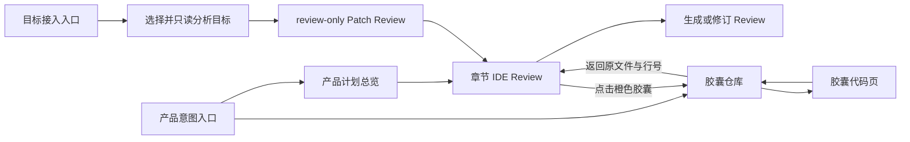

# Reweave 前端体验运行文档

- 文档性质：长期前端体验方向、场景契约与后续实施约束
- 状态：用户确认的产品方向；不等同于当前全部能力已经实现
- 当前事实基线：2026-07-19，`main` commit `91caa16`
- 维护原则：先区分当前事实与未来能力，再讨论视觉和实现；不得用界面预演冒充后端能力

## 1. 文档定位

本文集中记录 Reweave 的前端体验方向，避免长期产品决定散落在对话、阶段验收和局部实现中。它回答以下问题：

1. 用户进入 Reweave 后应看到哪些独立场景。
2. 胶囊仓库、胶囊代码页、产品计划和代码 Review 应如何衔接。
3. 简单模式与开发者模式分别展示什么。
4. 小语言模型可以在哪些位置提出建议，哪些决定仍属于确定性程序和用户。
5. 当前实现已经提供哪些数据，哪些视觉效果仍需要新的受控契约。
6. 后续前端解耦应围绕哪些真实场景进行，哪些重构不得提前发生。

本文不是当前实现规范，也不是阶段验收记录。当前行为和正式契约仍以代码、
`docs/REWEAVE_CAPSULE_INGESTION_DESIGN.md` 及对应验收记录为准；长期路线和硬边界仍以
`docs/REWEAVE_PRODUCT_NORTH_STAR.md` 为准。

## 2. 当前事实基线

### 2.1 已经实现

当前主线已经完成：

- 一个正式 SQLite 胶囊仓库和不可变胶囊版本。
- 一个 `module_native` 组合核心。
- 独立产品生成与 Static Web 目标接入两个清楚分离的交付入口。
- Static Web 目标的只读画像、确定性 Weave Plan、结构化 Patch、文本 Diff、验证与拒绝证据。
- 目标接入页面的默认简单模式和显式开发者模式、满足资格的胶囊卡片、文本 Diff、二进制元数据、验证与拒绝证据。
- 绑定 `plan_id` 与目标快照的内存态最终确认。
- 真实 `ReweaveAppService → QWebChannel bridge → QWebEngine UI` review-only 端到端证明。

当前目标项目、产品仓、warehouse revision 和 `product_capsule_usage` 在目标 Review 流程中保持零写入。最终确认不调用 bridge，也不表示应用、commit 或写入授权。

### 2.2 尚未实现

以下内容是本文确认的长期体验方向，但不能描述成当前能力：

- 用户只描述产品目标，由计划助手自动检索和建议胶囊组合。
- 面向完整 SaaS、数据库、登录、计费和任意框架的产品规划与生成。
- React + Vite 或 Node 目标接入。
- 对灰色能力缺口自动生成候选实现并完成正式验证。
- 可编辑、可对话修订的完整实现计划。
- 胶囊来源代码在最终文件中的可信行级或区间级映射。
- 在隔离目标副本中应用 Patch、构建、测试和行为验证。
- 对用户真实工作树执行 apply、commit 或回滚。

### 2.3 当前前端结构

当前桌面前端继续使用无构建步骤的原生 HTML、CSS 和 JavaScript。`target_workflow.js` 已经承载目标接入的状态、
契约校验、DOM 引用、渲染、事件、失效控制、开发者模式、内存态最终确认和 `getState().target` 投影；
`reweave_frontend/app.js` 仍是其余桌面职责的大型控制器。`bridge.js`、`artifacts.js`、`renderers.js`、
`source_workflow.js` 和 `capsule_reader.js` 继续承载各自的窄职责。

因此，当前只能宣称目标工作流解耦已经完成，不能宣称本文四个新场景已经全部解耦或实现。后续解耦必须由
本文定义的真实场景和第二个真实消费者驱动，不得为了文件大小预先引入框架、抽象工厂、第二状态机或平行前端。

## 3. 总体体验愿景

Reweave 的前端不是一个同时摆满仓库、聊天、计划、Diff 和管理面板的巨大工作台。它由若干可逆切换的完整场景组成，每次只让用户处理一个主要问题。



总体原则：

- 使用场景切换代替永久侧栏和多面板堆叠。
- 每个状态只保留一个主要动作；其余动作在选择具体对象后按需出现。
- 用户返回上一场景时恢复原来的项目、节点、文件、滚动位置、缩放比例和键盘焦点。
- 简单模式和开发者模式消费同一份状态和后端结果，不建立第二条工作流。
- 前端只展示后端和唯一组合器已经证明的事实，不自行推断安全、来源、路径或代码区间。

## 4. 交付模式与入口

### 4.1 独立产品模式

长期的主要体验是意图驱动的独立产品生成：

1. 用户描述希望创建什么产品。
2. 计划助手把目标拆解为前端、后端、数据与基础设施能力。
3. 系统只从满足资格的正式胶囊中检索候选。
4. 找到的胶囊形成可解释的拼贴方案；找不到的能力显示为灰色缺口。
5. 用户 Review 完整实现计划，并通过注释要求解释或修订。
6. 确定性程序根据已经确认的计划进行组合、验证和生成。
7. 用户在 IDE 场景中 Review 真实代码、Diff、来源和验证结果。

示例意图：

> 我想做一个带数据库的完整中台 SaaS，整体风格接近我以前做过的项目。

计划 Review 应明确展示：

- 产品范围和用户旅程。
- 前端页面、组件和交互。
- 后端服务、API、权限与任务。
- 数据模型、迁移、存储和运行环境。
- 仓库中匹配到的精确胶囊及来源项目。
- 尚未覆盖的能力缺口。
- 构建、测试、安全和验收方式。
- 风格参考来自哪些由用户明确授权的旧项目或品牌资料。

“风格接近旧项目”不能等同于任意复制来源代码。系统必须绑定用户明确选择的参考项目、正式 presentation 胶囊或受控品牌资料，并保持来源、范围和验证证据可追溯。

### 4.2 目标接入模式

目标接入用于把正式胶囊受控接入用户已有项目。当前支持面只到单入口 Static Web review-only Patch。

#### 4.2.1 当前正式流程

当前目标接入必须保持以下单线闭环：

```text
进入目标接入
→ 选择一个本地目标目录并明确确认一个 HTML 入口
→ 对精确目标快照执行只读分析
→ 查看资格结果或结构化拒绝证据
→ 描述本次任务并选择满足资格的正式胶囊
→ 请求绑定目标快照的 review-only Patch
→ Review 文件 Diff、二进制元数据、Weave Plan 与验证证据
→ 生成绑定 plan_id 和目标快照的内存态审阅回执
```

用户通过系统原生目录选择器选择本地项目，并在项目内明确选择或确认相对 HTML 入口。界面可以显示项目展示名和相对入口，但不得显示、记录或持久化绝对目标路径。

将项目文件夹拖入界面可以作为未来快捷方式，但不能成为唯一入口；键盘和触控用户必须能完成同一流程。拖入或选择只授予受控读取与分析，不表示上传、复制或写入。拖入文件夹后仍必须确认入口，不能把自动猜测的入口直接当作授权事实。

当前目标接入仍使用满足资格的胶囊卡片完成任务选择。下面的空间化节点表达是长期视觉方向，不得被描述成计划四已经实现的界面。

#### 4.2.2 长期空间表达

目标接入的长期空间表达可以使用：

- 目标项目位于中央。
- 满足资格的候选胶囊位于外围。
- 选中的胶囊仍留在外围，仅点亮通往目标的事实连线，避免造成“已经写入”的错觉。
- 不兼容胶囊以暗淡节点保留，聚焦时显示结构化原因。
- 生成动作始终叫做可审查方案或 Patch，不叫应用、安装或完成接入。

目标接入和独立产品模式共享同一仓库、胶囊模型、组合核心和证据主线，但保持两个清楚分离的入口。

## 5. 场景一：胶囊仓库

### 5.1 视觉来源

胶囊仓库的视觉灵感来自蜘蛛网的放射结构，以及阿比·瓦尔堡《记忆女神图集》中以并置、间隔和星丛关系组织材料的方式。

它不是传统思维导图，也不是需要用户维护的自由画布。空间、留白和疏密帮助用户理解来源与能力关系；连线不能为了装饰制造不存在的数据关系。

### 5.2 项目与胶囊层级

仓库有两个语义层级：

1. 来源项目总览：在没有上下文时，第一眼显示由来源项目节点构成的疏密有致、带放射感的蛛网画布。
2. 项目胶囊星丛：选中来源项目后，该项目节点移动到视觉中心，项目名称成为中心身份，所属胶囊从周围依次展开并向外放射。

如果用户从某个胶囊、计划项或已知项目进入仓库，直接进入对应项目的胶囊星丛，不先展示无关总览。

项目之间没有经过证明的业务关系时，不绘制项目到项目的数据连线。蛛网纹理可以提供极淡的空间氛围，但真实高亮连线只能表达正式来源、组合或依赖事实。

来源项目总览不强行制造一个没有事实含义的中央项目。它可以通过留白、尺度和视线重心形成放射感；只有进入具体项目后，来源项目才成为拥有明确语义的中心。

### 5.3 基础视觉

- 背景为接近纯黑的深色画布。
- 普通项目与胶囊节点为白色。
- 来源项目名称位于星丛中央。
- 节点布局自然、不完全对称，但必须稳定、可重复和视觉平衡。
- 不使用持续漂浮的物理模拟。
- 不允许用户随意拖动节点并保存另一套图状态。

### 5.4 节点交互

- 默认的来源项目与胶囊节点均为圆形。
- 鼠标悬停或键盘聚焦时，圆形平滑舒展为椭圆形。
- 当前节点名称在节点下方出现；来源项目名称和胶囊名称使用相同的低干扰显隐规则。
- 点击来源项目后，该节点平滑移动到中心，镜头保持空间连续，所属胶囊再从中心周围展开；不得突然替换成无关列表页面。
- 再次返回来源项目总览时，胶囊收拢回项目节点，镜头恢复进入前的位置、缩放比例和焦点。
- 点击胶囊后，该节点移动到视觉中心并展开为独立胶囊代码页。
- 返回时执行相反过渡，并恢复原来的节点、缩放和焦点。
- 动画必须提供“减少动态效果”替代；关闭动画后仍保持相同导航结果。

### 5.5 缩放、平移与搜索

- 画布支持滚轮、触控板和触控缩放。
- 同时提供可聚焦的缩放与复位控件，不能只依赖手势。
- 视觉缩放不应意外改变业务状态；进入和退出语义层级仍由明确点击、返回或 `Esc` 完成。
- 顶部只保留一个轻量搜索入口。
- 输入项目或胶囊名称后，其他节点降低亮度，匹配节点与事实来源路径被照亮。
- 确认结果后镜头平滑定位并放大到目标节点，用户可以直接打开。
- 返回搜索前状态时恢复先前画布位置。

内容很多时使用语义缩放：远处显示来源项目；进入项目后先看到能力区域；继续放大才显示独立胶囊。能力区域是现有胶囊事实的视觉聚合，不形成新的权威图数据库或人工可编辑关系。

## 6. 场景二：胶囊代码页

点击胶囊后进入一个独立页面。第一屏核心始终是系统已经提炼和验证过的真实函数或代码，不用说明卡片、指标和按钮把代码挤到次要位置。

### 6.1 简单模式

简单模式保留：

- 返回。
- 胶囊名称。
- 一条克制的来源路径，例如“来源项目 / 胶囊名称”，用于回答该代码属于哪个旧项目。
- 简单／开发者模式切换。
- 居中的核心代码。
- 代码字号缩小、放大与复位；同时支持平台标准键盘快捷键。

默认不显示目录树、完整 Hash、冗长来源详情或复杂证据。

代码页缩放只改变代码阅读尺度，不改变胶囊身份、验证状态或仓库画布缩放。缩放控件必须可聚焦，返回后保留该用户的阅读尺度；不得用只支持触控手势的自由画布替代普通代码阅读。

### 6.2 开发者模式

开发者模式在同一份胶囊数据上增加：

- 正式 capsule ID、version ID 和 capability kind。
- 来源项目与来源关系。
- 文件路径和入口符号。
- 输入、输出、错误与运行契约。
- 依赖和连接关系。
- 版本与 Diff。
- 验证、拒绝和 revalidation 证据。

如果一个完整能力在实现上包含代码、样式或资产依赖，用户不需要手工“划分胶囊”。简单模式突出核心代码，开发者模式再展开正式契约已经声明的组成与依赖。

## 7. 场景三：产品计划总览

### 7.1 第一屏

第一屏只展示产品目标、总体状态和折叠的计划章节，不同时打开聊天、仓库、文件树和 Diff。

章节使用手风琴式入口：

```text
项目总览

▸ 前端体验 · 管理中台        5 个匹配胶囊 · 1 个缺口
▸ 后端服务 · 租户与权限      3 个匹配胶囊 · 2 个缺口
▸ 数据与运行 · PostgreSQL    2 个匹配胶囊 · 无缺口
```

`前端体验`、`后端服务`、`数据与运行` 是稳定的属性和锚点；后面的副标题由计划内容生成。模型修订副标题时不能改变章节身份、注释锚点或历史引用。

收起状态仍显示：

- 已匹配胶囊数量。
- 灰色能力缺口数量。
- 未处理注释数量。
- 是否存在新修订或阻断问题。

### 7.2 手风琴的真实行为

章节不是在总览页面内向下撑开一块小卡片。点击章节后，它扩展并切换成一个完整的全屏 IDE Review 场景；返回时才重新收回为手风琴标题。

这样既保留总览的简洁，也让代码、文件和验证证据拥有足够空间。

收回方式必须等价：点击 IDE 顶部的当前章节标题或收回控件、使用明确返回按钮，或者在没有打开弹窗和没有正在编辑注释时按 `Esc`，都回到计划总览。收回后恢复原章节的展开焦点、总览滚动位置和未提交注释状态。再次进入同一章节时恢复原文件与阅读位置；只有计划版本失效时才进入新的章节状态。

## 8. 场景四：全屏 IDE Review

### 8.1 页面构成

IDE 场景可以包含：

- 顶部返回路径、章节名称、修订版本和模式切换。
- 文件标签。
- 主代码区。
- 胶囊来源标记与能力缺口。
- 行内注释锚点。
- 默认收起的底部修订输入框。

简单模式不常驻文件树和证据侧栏。开发者模式可以按需显示文件树、行号、逐行 Diff、Hash、Weave Plan、连接、映射与验证细节，但仍不同时堆叠所有面板。

### 8.2 橙色胶囊

橙色在 IDE 场景中只代表“代码来自经过验证的正式胶囊”，不是警告颜色。

可信胶囊区域应显示：

- 胶囊名称。
- 来源项目。
- 精确版本。
- 验证状态。

橙色使用细轮廓、侧边轨道或标题胶囊包裹代码，不以大面积橙色底破坏语法高亮和阅读对比度。

多个胶囊不能通过前端猜测形成嵌套彩色块。只有组合器或正式后端提供可信区间关系后，前端才允许包裹对应代码范围。

### 8.3 灰色能力缺口

计划需要但仓库没有合格实现时，显示灰色空心胶囊。缺口必须说明：

- 需要的能力。
- 为什么当前仓库没有匹配结果。
- 它影响哪个计划章节和交付结果。
- 后续候选实现需要经过哪些隔离验证。

状态变化：

- 灰色空心：尚无合格实现。
- 暖色等待态：候选实现在隔离环境生成或验证。
- 橙色胶囊：已经成为本次计划中可追溯的合格胶囊贡献。
- 珊瑚红拒绝态：验证失败或不允许进入计划。

候选失败时不得静默插入临时代码或隐藏缺口。

### 8.4 组合代码

唯一组合器生成的连接、适配或胶水代码使用普通代码样式，并明确标记为 composer contribution。它不伪装成某个来源胶囊，也不使用橙色胶囊身份。

### 8.5 生成前与生成后

在用户尚未批准生成时，IDE 场景不能伪造一份已经完成的产品源码。此时只允许展示：

- 已存在的真实胶囊代码。
- 确定的计划文件和映射。
- 灰色能力缺口。
- 尚未生成的连接位置或计划说明。

在隔离生成和验证完成后，同一个 IDE 场景升级为真实文件与 Diff Review。页面必须明确标记当前处于“规划”“候选已生成”还是“待审阅”状态。

### 8.6 主要动作与最终确认

产品计划和代码 Review 是两个不同的确认点，不能合并成一个含义模糊的“继续”：

1. 在计划状态，唯一主要动作表达“确认当前计划并生成候选”。它确认的是计划版本、胶囊选择和灰色缺口处理方式，不表示代码已经完成。
2. 系统只在隔离环境中根据该计划生成并验证候选。生成或验证失败时仍停留在 Review 场景，展示结构化失败和未完成缺口。
3. 在候选待审阅状态，唯一主要动作表达“确认已经审阅本轮候选”。它绑定精确计划、候选摘要和验证结果；任何未来真实应用或写入必须是另一个独立授权阶段。

按钮最终文案可以在低保真测试后缩短，但语义不能退化为不说明对象的“确认”“完成”或“继续”。用户提出注释或批准计划 Diff 后，旧候选及旧确认必须显式标记为已失效，不能让用户误以为评论已经落入原候选。

## 9. 从 IDE 返回胶囊仓库

点击 IDE 中的橙色胶囊后，进入同一个胶囊仓库的聚焦态，不创建第二个“展览仓库”。

进入行为：

- 直接定位到该胶囊所属来源项目的蛛网。
- 来源项目名称位于中央。
- 当前胶囊保持橙色并获得焦点。
- 其他胶囊维持白色。
- 用户可以查看核心代码、来源、版本和验证证据。

返回行为：

- 回到原来的 IDE 章节。
- 恢复原文件、滚动位置、行号和注释焦点。

如果用户认为该胶囊不适合本次产品，仓库只提供一个主要纠正动作：`重新匹配这个能力`。用户补充一句原因后，计划助手重新检索并生成计划 Diff。用户确认前原胶囊仍保留；没有合格替代时，该位置变为灰色能力缺口。

不提供直接拖拽替换、静默换胶囊或另一套候选选择状态机。

## 10. 注释、对话与计划修订

### 10.1 局部注释

用户可以像在 Codex 中一样，对计划项、灰色缺口或代码行添加注释。注释必须绑定：

- 当前计划版本。
- 稳定章节或文件身份。
- 具体计划项或代码位置。

计划修订后无法可靠重定位的注释必须标记为待重新确认，不能悄悄附着到错误内容。

### 10.2 全局修订输入框

不设置永久聊天侧栏或顶部聊天区。全局问题和修改通过底部浮动输入框完成：

- 默认只占一行。
- 需要时向上展开对话与修订记录。
- 支持引用计划项、代码行和胶囊。
- 胶囊可以拖入成为引用标签，但必须同时提供搜索、按钮和键盘添加方式。
- 引用胶囊不会立即改变计划。

用户完成多条注释后，默认批量提交一次修订，避免模型每收到一句就反复重算整份计划。

### 10.3 提问与修改

未来计划助手可以把输入分类为：

- 解释问题：只回答，不修改计划。
- 修改请求：生成计划 Diff，等待用户确认。
- 信息不足：提出澄清问题，不改变计划。

例如：

```text
计划项：数据库使用 PostgreSQL
用户注释：这个太重了
```

如果模型无法确定用户是要求解释还是替换数据库，应在该计划项旁追问。只有全局意图不明确时，才在底部输入框追问。

任何模型判断都不能直接写代码、应用计划或绕过确认。

## 11. 小语言模型在前端中的角色

### 11.1 当前正式角色

当前唯一正式的小模型角色是胶囊监督模型。它位于入库和清洗主线中，只接收经过脱敏的结构化候选摘要，返回严格的监督结果。它不参与当前聊天、产品意图理解、胶囊自动检索、计划修订或 Patch 生成。

### 11.2 未来角色

后续至少存在三种逻辑角色，但不表示必须运行三个不同的模型或三个服务：

| 逻辑角色 | 职责 | 权限边界 |
|---|---|---|
| 胶囊监督模型 | 对已提取、脱敏候选提出监督建议 | 不能改变代码边界、契约、安全或发布 |
| 产品计划助手 | 理解意图、检索合格胶囊、解释和提出计划 Diff | 只能建议，不能发布、应用或写入 |
| 缺口实现模型 | 在隔离环境生成灰色缺口的候选实现 | 候选必须重新经过安全、验证与人工 Review |

相同本地模型运行时可以复用，但每个角色必须拥有独立配置、输入 Schema、输出 Schema、模型 digest、证据和失败策略。当前 `capsule_supervision_model` 不应被无边界扩大为通用聊天或生成模型。

确定性程序继续负责：

- 代码与胶囊边界。
- 来源和事实关系。
- 路径、资源和权限。
- Hash、安全与敏感数据门。
- 组合、执行和验证。
- 发布与正式写入。

## 12. Patch 的产品语义

Patch 是一次绑定精确输入的可审查文件改动快照，不是持续向项目注入代码的隐藏过程。

```text
目标项目快照 S1
+ 用户任务
+ 精确胶囊版本集合
= Patch P1
```

如果用户修改目标、入口、任务或胶囊，旧 Patch 失效，系统基于新快照生成新的 Patch。多轮完善可以形成连续 Review，但每一轮仍是独立、可追溯的新方案，不在后台累积未知写入。

当前确认只产生内存态审阅回执。未来即使支持真实应用，也必须先在隔离副本中执行、构建和验证，并另行取得真实工作树写入授权。

### 12.1 当前目标接入的失效规则

当前目标接入页面必须把失效作为可见状态，而不是在后台悄悄清空：

| 用户改变的输入 | 必须失效的结果 | 下一步 |
|---|---|---|
| 目标目录或 HTML 入口 | 目标画像、Patch、最终确认 | 重新只读分析目标 |
| 任务描述或胶囊选择 | Patch、最终确认 | 基于原目标快照重新生成 Patch |
| 简单／开发者显示模式 | 最终确认 | 重新 Review 后确认；不重复调用后端生成 Patch |
| 后端返回的目标快照与当前快照不一致 | Patch、最终确认 | 显示结构化过期状态并重新分析 |

失效后，旧结果可以作为明确标注的历史 Review 只读查看，但不得继续使用旧的主要确认动作。当前页面不得为了恢复确认而自动调用 bridge、自动重新生成或扩大目录读取范围。

### 12.2 长期独立产品的版本绑定

未来独立产品流程需要把产品意图、计划版本、精确胶囊版本、灰色缺口决定、生成候选和 Review 回执形成一条可追溯绑定。用户确认计划 Diff 后，基于旧计划生成的候选立即失效；用户只修改查看模式、缩放或折叠状态时，不应使候选失效。

前端只消费正式返回的版本与失效原因，不自行比较代码字符串来猜测候选是否过期。

## 13. 色彩与状态语言

基础视觉保持克制：

- 背景：黑色或接近黑色。
- 普通项目与胶囊节点：白色。
- 胶囊来源身份：橙色。
- 搜索命中和交互焦点：冷青蓝。
- 校验通过和新增：低饱和薄荷绿。
- 错误、拒绝和删除：柔和珊瑚红。
- 警告：通过图标、轮廓和受控暖黄色共同表达，不能与橙色胶囊身份混淆。
- 不可用：降低亮度并保留可聚焦说明。

颜色不得成为唯一信息载体。状态同时使用文字、轮廓、图标或纹理，满足色觉差异和高对比需求。

## 14. 文字与按钮预算

前端必须主动控制文字和按钮数量。规则不是“整个页面永远只有一个按钮”，而是“每个工作状态只有一个主要动作”。

| 场景 | 常驻必要控件 | 按需出现 |
|---|---|---|
| 胶囊仓库 | 搜索、缩放复位 | 节点详情、重新匹配 |
| 胶囊代码页 | 返回、模式切换 | 来源与验证详情 |
| 产品计划总览 | 手风琴章节、收起的修订输入框 | 章节状态解释 |
| IDE Review | 返回、模式切换、文件标签、收起的修订输入框 | 行内注释、Diff 与证据 |
| 目标选择 | 当前阶段的唯一主要动作 | 分析结果或结构化拒绝 |

约束：

- 不设置永久侧栏。
- 不同时展示仓库、计划、聊天和 Diff。
- 不重复放置含义相同的“下一步”“继续”“确认”按钮。
- 状态摘要优先使用简短数字、标记和标题；详细解释按需展开。
- 纯图标控件必须有可访问名称和聚焦说明。
- 危险或不可逆动作不得为了“简洁”隐藏授权与后果。

## 15. 动画与空间连续性

动画用于解释场景之间的关系，不用于装饰：

- 胶囊节点放大并展开为代码页。
- IDE 中的橙色胶囊收拢为仓库节点。
- 返回执行可理解的反向过渡。
- 搜索命中后镜头移动到目标，而不是突然替换所有内容。
- 手风琴章节扩展成完整 IDE 场景，而不是挤压总览页面。

动画必须短、稳定、可中断，并尊重系统“减少动态效果”设置。关闭动画后，焦点、导航历史和业务状态必须完全一致。

## 16. 可访问性底线

- 所有悬停能力必须有键盘聚焦等价行为。
- 所有拖拽能力必须有点击、搜索或键盘替代。
- 画布缩放必须提供可聚焦控件和复位动作。
- `Esc` 和明确返回控件都能退出当前语义层级。
- 返回后恢复合理焦点，不能把键盘用户丢回页面顶部。
- 代码、Diff、注释和状态不能只靠颜色区分。
- 动画遵循 `prefers-reduced-motion` 或等价桌面设置。
- 简单模式隐藏复杂度，但不能隐藏安全、授权、失败或数据损失风险。

## 17. 数据与契约边界

### 17.1 当前可以支持

当前正式数据已经可以支持：

- 来源项目与胶囊的正式来源关系。
- 精确 capsule/version 身份。
- 胶囊类型、契约、状态和验证证据。
- Patch 影响文件、文本 Diff、二进制元数据。
- 文件级 composer provenance、连接和输出映射。
- `plan_id` 与目标快照绑定。

### 17.2 当前不能支持

当前 Patch 和 composer provenance 只能可靠表达文件级贡献，不能证明某个胶囊精确对应最终文件中的第几行到第几行。

因此：

- 当前 UI 可以在文件级展示橙色胶囊标签和贡献者列表。
- 当前 UI 不得通过字符串搜索、Diff 猜测或前端启发式包裹具体代码区间。
- 未来若要实现精确橙色代码胶囊，必须由唯一组合器或正式后端产生确定性的代码区间映射。
- 该映射必须绑定精确 capsule version、输出文件 Hash 和区间身份；具体 Schema 名称在独立契约阶段确定，本文不把暂定字段写成已实现 API。

自动胶囊检索、计划助手、评论锚点迁移和灰色缺口候选生成也需要各自的窄契约。它们不得复活历史排除路径、建立第二仓库或让前端复制后端资格判断。

## 18. 前端解耦方向

### 18.1 解耦目标

解耦的目标是让四个真实场景可以独立渲染、测试和切换，同时共享一个受控应用状态与 bridge 边界：

1. 胶囊仓库场景。
2. 胶囊代码场景。
3. 产品计划总览场景。
4. IDE Review 场景。

目标接入和独立产品入口继续共享正式胶囊读取、模式切换、证据展示和导航机制，但不能共享出含义模糊的巨大条件分支。

### 18.2 暂不做

- 不因为 `app.js` 很大就一次性重写。
- 不提前引入 React、Vue 或新的构建系统。
- 不创建通用场景工厂、插件系统或可配置布局引擎。
- 不建立第二份前端权威状态。
- 不让视觉原型直接调用新 bridge 或写正式数据。
- 不在缺少第二个真实消费者时提取抽象接口。

### 18.3 推荐顺序

1. 以本文为范围完成四个场景的低保真原型。
2. 用当前后端返回构造只读视图模型，标出真实数据与占位数据。
3. 先验证导航、按钮预算、键盘和减少动画体验。
4. 确认需要复用的第二个真实场景后，再提取最小纯渲染或状态逻辑。
5. 新契约单独设计、单独验收后，才接入自动计划、代码区间或候选生成。

### 18.4 交给主窗口的实施边界

主窗口后续实施以本文作为前端体验北极星，但必须把“当前工作”和“未来原型”分开：

1. 当前解耦只整理已经存在的目标接入工作流、状态失效和渲染职责，不改变计划三后端契约，不增加 bridge 方法，不移动发布 Tag。
2. 蛛网仓库、产品计划助手、灰色缺口生成和行级橙色胶囊先作为低保真只读原型；原型数据必须清楚标记为 fixture 或占位，不接正式仓库写入。
3. 先提取最小场景切换与只读视图模型，保持现有原生 HTML、CSS、JavaScript，不一次性重写 `app.js`，不新增框架或依赖。
4. 每个实施切片只选择一个可独立验收的场景或状态转换；不得在一次提交中同时改仓库画布、计划助手、后端契约和真实生成。
5. 若视觉需求需要当前契约不存在的数据，例如行级 provenance、自动胶囊检索或评论锚点迁移，主窗口必须停在占位状态并先提出独立契约计划，不由前端猜测。

建议主窗口把近期工作切成以下最小顺序：

1. 保住并测试现有目标接入完整闭环与失效规则。
2. 从大型控制器中提取有第二个真实消费者的场景导航和只读展示逻辑。
3. 制作不接新 bridge 的胶囊仓库低保真原型，验证项目节点展开、搜索、缩放、返回和键盘路径。
4. 制作产品计划总览与全屏 IDE 的低保真原型，验证手风琴收回、橙／灰状态、注释和按钮预算。
5. 根据原型暴露的真实数据缺口，再分别规划窄后端契约。

每一步完成后都要单独证明没有改变目标工作树、产品仓、warehouse revision 或 `product_capsule_usage`，并保留现有简单／开发者模式和 review-only 确认语义。

## 19. 验收原则

未来任何前端实施阶段至少证明：

- 当前正式双入口、简单／开发者模式和 review-only 安全边界没有退化。
- 当前目标接入仍完整覆盖目录与入口确认、只读分析、资格或拒绝、任务与胶囊选择、Patch Review 和内存态确认。
- 目标、入口、任务、胶囊、显示模式或快照变化按照正式规则使对应结果失效，旧结果不能继续确认。
- 一个场景退出后不会遗留错误的项目、Patch、确认或模型状态。
- 返回能恢复画布、文件、行号、滚动和键盘焦点。
- 来源项目节点进入中心并展开胶囊；反向导航恢复进入前的镜头、缩放和焦点。
- 手风琴章节可通过章节收回控件、返回与安全条件下的 `Esc` 回到同一计划总览状态。
- 搜索、缩放、注释和模式切换均有真实键盘路径。
- 后端字符串继续以文本方式安全渲染。
- 二进制内容不被前端解码或执行。
- 前端不显示、记录或持久化禁止暴露的绝对路径和原始敏感内容。
- 计划和 UI 不宣称当前不存在的 React、Node、数据库或真实写入能力。
- 橙色代码区间只能来自正式证据，不能由前端猜测。
- 每个状态只有一个清楚的主要动作，不出现永久多面板堆叠。

低保真原型通过不等于实现通过；静态页面通过不等于真实 bridge、状态失效和 QWebEngine 交互通过。

## 20. 已确认决定与开放项

### 20.1 已确认决定

- 胶囊仓库采用黑色、白色节点、放射蛛网和星丛式空间表达。
- 来源项目居中，胶囊围绕来源项目展开。
- 节点悬停或聚焦时由圆形展开为椭圆并显示名称。
- 支持缩放、平移、复位、搜索和搜索后直接定位。
- 胶囊点击后进入独立代码页。
- 简单模式与开发者模式保留。
- 长期独立产品主流程是用户描述意图、模型建议胶囊拼贴、用户 Review。
- 完整计划按前端、后端、数据与基础设施组织。
- 计划总览使用手风琴入口；章节展开为全屏 IDE，而不是内嵌小卡片。
- IDE 中橙色表示正式胶囊来源，灰色表示能力缺口。
- 支持 Codex 式行内注释和底部全局修订输入框。
- 模型修改只能生成计划 Diff，必须再次确认。
- 点击 IDE 中的橙色胶囊进入同一个仓库的聚焦态。
- 不合适的胶囊通过“重新匹配这个能力”提出修订，不直接替换。
- Patch 是可重复生成的独立审查快照，不是隐藏的持续写入过程。
- 每个状态只保留一个主要动作，控制文字、按钮和永久面板数量。

### 20.2 尚待后续阶段决定

- 独立产品与目标接入在未来首页中的最终视觉入口比例。
- 计划助手的模型选择、Schema、上下文预算和失败策略。
- 用户授权旧项目作为风格参考的具体选择与撤销流程。
- 精确代码区间 provenance 的正式 Schema。
- 灰色缺口候选生成的隔离环境、验证门和发布流程。
- React + Vite、Node、数据库与完整 SaaS 的分阶段支持顺序和真实验收项目。
- 隔离目标副本的 apply、构建、测试、行为验证与回滚凭证。

这些开放项不能通过前端占位按钮提前变成产品承诺。

## 21. 文档维护规则

只有以下情况修改本文：

- 用户确认新的长期前端体验决定。
- 已有决定被明确替换或删除。
- 某项未来能力完成正式契约与真实验收，状态需要从“未来”更新为“当前”。
- 当前代码与本文的事实基线产生实质冲突。

单次测试数字、临时分支、局部缺陷和实现过程不在本文持续累积，应记录在阶段设计、验收或提交历史中。

本文新增视觉细节时必须同时检查：它是否有真实数据来源、是否增加永久控件、是否建立第二状态、是否越过安全或写入边界。任一答案不明确时，先停在设计与原型阶段。

## 22. 参考文档

- `docs/REWEAVE_PRODUCT_NORTH_STAR.md`
- `docs/REWEAVE_CAPSULE_INGESTION_DESIGN.md`
- `docs/ARCHITECTURE.md`
- `docs/DESKTOP_USER_FLOW.md`
- `docs/REWEAVE_ARCHITECTURE_COUPLING_RECORD.md`
- `docs/reports/REWEAVE_STATIC_WEB_TARGET_PATCH_ACCEPTANCE.json`
- `docs/reports/REWEAVE_STATIC_WEB_TARGET_UI_ACCEPTANCE.json`
- `docs/reports/REWEAVE_STATIC_WEB_TARGET_REAL_E2E_ACCEPTANCE.json`
- Cornell University, *The Mnemosyne Atlas*: https://warburg.library.cornell.edu/
- The Warburg Institute, *Mnemosyne Atlas*: https://warburg.sas.ac.uk/library-collections/warburg-institute-archive/archive-collections/verknupfungszwang/mnemosyne-atlas
