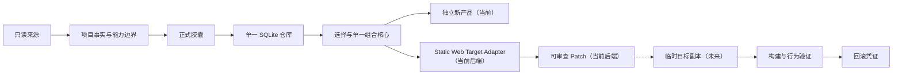

# Reweave 产品北极星

文档性质：长期产品方向与演进指引

已发布基线：Reweave Static Web V1（v0.3.0）

当前主线：Static Web 目标画像与 review-only Patch 后端

更新时间：2026-07-19

## 1. 文档定位

本文回答三个问题：Reweave 今天是什么、最终希望成为什么、应当按什么顺序前进。

本文不是当前实现规范，也不表示文中所有能力已经完成。当前代码行为和正式契约以代码及
`docs/REWEAVE_CAPSULE_INGESTION_DESIGN.md` 为准；阶段验收以对应验收记录为准；发布状态以 Git Tag 和托管 CI
为准。历史设计与验收记录保留形成时的事实，不因后续发布而回写；这些权威来源与本文冲突时应修订本文。

本文不会替代阶段验收记录。测试数量、临时环境路径和单次审计结果不写入北极星文档，避免短期证据变化
使长期方向失真。

## 2. 当前 Reweave

当前 Reweave 是一个本地优先、来源和目标只读的 Static Web 能力提取、正式仓储、独立产品生成和
review-only 目标 Patch 规划系统。

当前正式主线是：

```text
来源项目
→ 只读一致性快照
→ presentation / interaction / computation 原子胶囊
→ 固定安全规则、本地监督和隔离运行验证
→ 人工复核
→ 单一 SQLite 正式仓库
→ 单一 module_native 组合器
→ 独立的 index.html / styles.css / app.js 产品
→ manifest、精确版本 usage 和本地历史
```

同一仓库和组合核心现在还有一条只读目标交付支线：

```text
满足资格的正式胶囊 + 用户授权的精确目标快照
→ 目标路径、HTML 资源引用和 JavaScript module 闭包校验
→ 同一个 module_native 组合器
→ static_web_iframe_embed.v1
→ 结构化文件 Patch、文本 Diff、Weave Plan 和拒绝证据
→ 目标项目、产品仓和 usage 零写入
```

当前已经具备：

- 来源项目只读扫描和一致性证据。
- 单一 SQLite 正式胶囊仓库及不可变版本。
- presentation、interaction、computation 三类原子胶囊契约。
- JavaScript、HTML、CSS、资产和数据契约安全门。
- 本地 Ollama 监督边界，以及隔离的 Node、图片和 QWebEngine 验证。
- 单一 `module_native` 组合器、产品 manifest 和精确版本 usage。
- 备份、恢复、停用和选择性重新验证。
- JavaScript computation capture 阶段 A–G，以及固定第三方项目和真实产品交互的正向验收。
- 单入口 Static Web 目标的只读画像、精确快照授权、确定性 Weave Plan 和可审查结构化 Patch 后端。

当前仍未完成：

- 面向目标接入的新页面、双入口、简单/开发者模式、胶囊卡片、文件 Diff 和最终确认闭环。
- React + Vite 与 Node 目标项目的受控接入。
- 直接应用、commit 或回滚用户真实工作树的事务能力。

因此，当前 Static Web V1 支持面内的本地闭环、Stage G 第三方正向证明和计划三 review-only Patch 后端已经
`PASS`。这不证明任意项目接入、目标 Patch 的前端交互、真实工作树应用、外部 presentation/interaction 自动拆分
或后续框架支持。

## 3. 长期北极星

Reweave 的长期使命是：

> 观察工程事实，封装可验证能力，规划受控重组，交付可审查、可回滚的结果。

长期产品应帮助用户：

1. 从已有项目中识别真正可复用的软件能力。
2. 把能力的实现、契约、权限、来源和验证证据封装为不可变胶囊。
3. 按用户目标选择兼容能力，并生成显式、可解释的重组计划。
4. 在隔离环境中完成组合或接入，运行真实验证。
5. 交付独立产品，或交付面向已有目标项目的可审查、可回滚改动。

模型负责命名、分组、监督和有限的语义建议。确定性程序继续负责代码边界、事实关系、权限、安全、
哈希、执行、验证和发布。模型不能绕过规则、生成未经约束的 adapter 或自动发布正式版本。

## 4. 一个核心，两种交付

Reweave 长期保留两种正式交付方式：

1. **独立产品模式**：从正式胶囊生成一个新的、可独立运行的产品。
2. **目标接入模式**：把正式胶囊受控接入用户已有项目，并交付可回滚改动。

两种模式共用同一个正式仓库、同一套胶囊契约、同一个组合核心和同一条证据主线。目标接入不会发展成
第二个仓库、第二个 composer 或绕过正式门禁的旁路。



目标接入的适配顺序固定为：

```text
单入口 Static Web
→ React + Vite
→ Node 后端
```

三类目标分别验收、顺序实施，不同时开工，也不通过放宽 Static Web 规则冒充框架支持。

## 5. 现有基础与目标模型

### 5.1 Project IR

当前 `projects`、`project_file_index`、一致性快照和进程内 `source_graph.v1` 是 Project IR 的窄基础。
它们已经能表达受控 JavaScript 来源中的文件、模块、导出、函数和依赖事实。

未来只有在目标接入出现真实消费需求时，才逐步增加路由、API、配置、数据库、测试和构建事实。
不提前建立第二个 Graph Store，也不为了“完整”持久化无人使用的关系。

### 5.2 Capsule IR

当前 SQLite 中的 capability group、capsule、immutable version、contract、scope、source、asset、status event
和 validation evidence 已经是唯一权威的 Capsule IR。未来只在现有模型上进行受控迁移，不建立目录式第二仓库
或并行胶囊格式。

### 5.3 Weave Plan

当前胶囊选择、连接关系和产品 manifest 支撑独立 Static Web 产品；`static_web_weave_plan.v1` 在同一主线上
增加了首个目标接入窄契约，绑定精确胶囊版本、目标快照、固定 adapter、受影响文件、验证步骤和失败策略。

目标接入的 Weave Plan 需要显式描述：

- 选用了哪些精确胶囊版本。
- 目标项目中将影响哪些位置。
- 使用哪一种确定性适配策略。
- 需要新增、修改或删除哪些文件。
- 将运行哪些构建、测试和行为验证。
- 每一步失败时如何停止和回滚。

当前 Weave Plan 只生成 Static Web 可审查 Patch，不直接写用户项目；它不是覆盖所有框架的通用计划语言。

### 5.4 当前尚不存在的能力

以下能力属于未来，不得在产品说明中写成已经完成：

- 面向任意项目和框架的完整目标画像。
- 跨项目兼容性规划器。
- 面向任意框架的 Target Adapter。
- 新页面、双入口、双模式、胶囊卡片、文件 Diff 和最终确认的前端闭环。
- 临时工作树中的目标项目改动应用。
- 目标项目构建、测试和行为验证编排。
- 把 Patch 直接应用为 commit 或可回滚事务的交付。

## 6. 当前总路线图

当前只保留以下四个可独立验收的计划。每个计划有自己的完成条件，不把后续能力夹带到前一计划。

### 计划一：Stage G 发布收口（已完成）

- 只处理托管 CI、发布候选和 Tag，不夹带新功能。
- Ubuntu、Windows 和 CodeQL 托管检查通过，发布主线以 `v0.3.0` 收口。

### 计划二：遗留清理与北极星校准（已完成）

- 可达性证明确认 `scripts/run_public_stage4_demo.py` 只剩文档、发布面分类和固定失败测试引用；正式 CLI、桌面启动器、
  生产调用图和托管 CI 均不能到达，直接执行也在写入前固定失败。
- 删除该旧 Stage 4 公开 demo 入口及只为它存在的引用和测试；发布面继续只承认正式 SQLite CLI。
- 本文正式纳入版本控制，作为唯一总路线图。
- 仍可达的兼容代码、旧 composer、QWebChannel 槽位、前端清理和依赖清理不属于本计划，不能用本次结论扩大删除范围。

### 计划三：后端——Static Web 最小闭环（已完成）

首个目标接入后端切片只支持单入口、无需安装或构建的 Static Web 目标：

```text
用户选择目标站点
→ 只读建立目标画像
→ 校验目标路径、资源引用和授权边界
→ 生成显式 Weave Plan
→ 生成文件级可审查 Diff 与 Patch
→ 返回验证证据和拒绝原因
```

完成边界固定为：

- 目标画像仅存在于进程内，显式绑定单一 HTML 入口和稳定快照摘要，不写入 `projects` 或 `project_file_index`。
- 路径、symlink、大小写/Unicode 冲突、HTML 资源引用、CSS 未支持资源语法和本地 JavaScript module 闭包均失败关闭。
- Patch 授权模式只接受 `review_patch_only` 并绑定精确目标快照；受影响路径由后端生成，不能请求 apply、write 或 commit。
- 只消费满足资格的 active-current 正式版本和 `general` usage scope；缺少可信目标品牌身份时结构化拒绝 `brand_limited`。
- `module_native` 仍是唯一组合器；固定 `static_web_iframe_embed.v1` 只把其唯一结果映射到内容寻址命名空间。
- 返回完整 UTF-8/base64 文件内容、hash、文件级文本 Diff、Weave Plan、provenance 和拒绝证据；二进制不伪造文本 Diff。
- 返回前重新核对胶囊资格和目标快照；目标项目、产品仓与 `product_capsule_usage` 均零写入。

本计划没有新增前端页面或桌面桥接槽位，没有应用 Patch，也不把 Capsule IR 尚未表达的法律许可证判断写成自动授权。
任何真实工作树应用、commit 或回滚事务都必须在本计划之外另行批准。

### 计划四：前端——完整交互闭环（待实施）

- 增加目标接入新页面，并保留与现有独立产品模式清楚分离的双入口。
- 提供简单模式和开发者模式、胶囊卡片、文件 Diff、验证/拒绝证据以及最终确认。
- 前端只消费计划三定义的后端契约，不复制路径、资源、授权或 Patch 生成规则。
- 最终确认表示用户确认导出结果，不自动扩大为写入真实项目的授权。

四计划完成后，长期目标类型仍按 `Static Web → React + Vite → Node` 顺序推进。这里的 Node 指未来要接入的
目标项目类型，不是计划三的 Reweave 后端工作；React/Vite 和 Node 都需要各自的设计与真实项目验收。

## 7. 计划成功原则

每个计划都必须有独立、可证伪的完成门：

- 计划一以托管 CI、发布候选和精确 Tag 为门。
- 计划二以可达性证明、精确删除和北极星文档进入版本控制为门。
- 计划三以目标来源摘要不变、路径/资源/授权校验、确定性 Patch 和结构化拒绝证据为门。
- 计划四以双入口、双模式、胶囊卡片、文件 Diff 和最终确认的完整交互为门。
- 提取或目标接入能力使用固定、不可事后替换的第三方项目样本。
- 不安装、构建、运行或修改来源项目，除非后续目标事务契约明确允许在临时副本执行目标命令。
- 来源摘要、正式版本、产物和验证证据必须可追溯。
- 真实业务断言必须验证输入、操作和结果；窗口启动或测试数量不等于能力通过。
- 未达到门槛时标记 `PARTIAL`，不通过新增 fallback、模板或模型改写制造成功。

## 8. 硬边界

- 始终保持一个 SQLite 正式仓库、一个胶囊模型、一个组合核心和一个发布主线。
- 不增加第二 repository、第二 composer、长期运行时双路径或隐藏 fallback。
- 不让模型决定代码边界、放宽安全规则、生成自由 adapter 或自动发布。
- 不提前建设插件平台、CAS、OCI、MCP/WIT 分发、Nix 环境或五工作区大型 UI。
- 不为未来框架预先增加抽象；只有经过验证的第二个真实消费者出现后，才提取公共接口。
- 计划三后端只读分析目标并生成可审查 Patch，不直接写用户项目；未来如需应用验证，只能先在隔离临时副本进行。
- 计划四的最终确认不等于用户真实工作树的写入授权。
- React/Vite 和 Node 是明确路线目标，但必须在 Static Web 目标事务闭合后顺序实施。

## 9. 已确认产品决定

1. 独立产品生成是长期正式能力，不是临时过渡路径。
2. 目标项目接入也是长期正式能力，但不得取代或复制独立产品主线。
3. 第一个目标接入类型是单入口 Static Web。
4. React/Vite 和 Node 目标项目必须在当前四计划之后进入后续路线，但分别设计、分别验收、顺序实施。
5. 现有 SQLite 胶囊仓库继续是唯一权威状态。
6. `module_native` 继续是唯一组合器；当前 Static Web Target Adapter 只负责把唯一组合结果映射为目标 Patch，未来 adapter
   也不得复制组合逻辑。
7. 当前总路线固定为四个独立验收计划；计划三后端和计划四前端不得互相夹带能力。
8. 目标接入的最终确认不自动授予真实项目写入权限。

## 10. 文档维护规则

只有以下情况需要修订本文：

- 产品交付方式发生改变。
- 支持目标的顺序或硬边界由用户重新确认。
- 一个未来能力经过真实验收，正式成为当前能力。
- 当前代码与本文对“已实现”的描述产生冲突。

单次测试数字、临时路径、局部缺陷和阶段审计过程不写入本文，继续记录在正式设计或验收证据中。

## 11. RepoNavigator 研究边界

本节记录一项 Stage G 之后可能采用的开发者导航 UX 参考，不属于当前实施范围，也不改变任何提取、
安全、监督、验证、仓储或发布契约。

### 11.1 论文实际证明了什么

参考论文：[*One Tool Is Enough: Reinforcement Learning of LLM Agents for Repository-Level Code Navigation*，
arXiv:2512.20957 v6，2026-05-26](https://arxiv.org/html/2512.20957)。

论文解决的是 repository-level issue localization：输入代码仓库和 issue 描述，输出可能需要修改的文件与函数位置。
它没有研究代码抽取、胶囊边界、安全证明、行为等价或受控发布。

论文的核心工具 `jump` 由 language server 解析符号引用并返回定义代码。模型负责选择下一次跳转以及何时停止；
论文也明确说明 `jump` 不是自动揭示相关代码的 oracle。

实验还有四项不能省略的适用条件：

- 论文偏离原 SWE-bench 协议，为 RepoNavigator 和所有基线提供精确入口文件及对应入口函数。
- 实验只使用 Python 仓库。
- 作者明确说明只成功实现了 Python language server，其他语言仍待实现和验证。
- GRPO 训练中，7B 使用 8 张 NVIDIA Tesla A100 80G，14B 和 32B 使用 16 张同规格 GPU。

因此，该论文没有证明能从完全未知的大型 JavaScript 仓库中自动找到用户需要的业务函数，也没有证明其轨迹
可以成为 Reweave 的确定性依赖闭包。

### 11.2 对 Reweave 有价值的部分

Reweave 只借鉴两个产品原则：

1. 沿真实词法绑定、import 和定义关系导航，比纯关键词检索更适合解释代码结构。
2. 一个清晰、只读的“跳到定义/查看依赖链”动作，优于增加搜索、向量库、RAG 和多套松散检索工具。

当前 `source_graph.v1` 已经提供本项目最需要的确定性基础：TypeScript lexical symbol graph、import/export
resolution、selected function identity、依赖闭包和失败关闭。未来导航界面必须复用现有 node identity、逻辑路径
和 UTF span，不新建第二个事实来源。

如果后续原型通过，普通模式可以显示一句可操作结论，例如“可抓取；依赖 3 个 helper 和 2 个常量”，
或“不可抓取：依赖可变共享状态”。开发者模式可以提供只读“跳到定义”和“查看依赖链”。源码只能按当前快照
临时读取，不进入 SQLite、不缓存到前端，也不发送给 Ollama。

### 11.3 明确不采用的部分

- 不接入 RepoNavigator runtime，不进行本地 RL 训练。
- 不增加第二 language server、第二索引、第二 graph、向量库、RAG 或第二候选主线。
- 不把模型的 jump 轨迹当作 dependency closure；漏跳不能使危险依赖消失。
- 不让 RepoNavigator 或模型决定胶囊边界、纯度、data contract、安全、canonical evidence 或等价关系。
- 不用它解决业务字段映射，也不减少现有人工确认。
- 不把论文结果扩大为 JavaScript、DOM/Event、QWeb、bundle、SQLite 或 `module_native` 的有效性证明。

Stage G 不因本研究增加依赖、接口、测试或实施任务。

### 11.4 Stage G 之后的可证伪原型门

Stage G 已完成只满足研究前置条件，不构成启动批准。RepoNavigator 不在当前四计划内；只有用户另行批准，
并且用户仍难以理解目标函数和阻断依赖时，才允许进行一次只改展示的对照原型。原型不得改变抓取结果。

固定研究方式：

- 使用 6–8 个冻结 JavaScript 项目。
- 对照当前 offer 详情与基于同一 `source_graph.v1` 的 jump/依赖链视图。
- 任务固定为定位目标函数、识别一个 helper、解释一个 fail-closed 原因。
- 记录完成时间、错误选择次数、源码查看次数和阻断原因复述准确性。
- 两组必须得到完全相同的 source graph、offer、canonical hash 和 Stage 3 outcome。
- 原型只能读取已有图证据，不增加持久化或模型输入。

只有显著减少理解时间或误选，并且安全与持久化结果零变化时，才进入正式产品；否则删除原型。
即使通过，也只能声称改善了结构导航体验，不能声称 Reweave 已能自动拆解普通旧项目。
