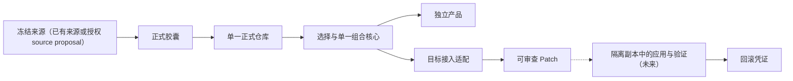

# Reweave 产品北极星

文档性质：长期产品方向与演进指引

更新时间：2026-08-18

## 1. 文档定位

本文回答三个问题：Reweave 今天是什么、最终希望成为什么、应当按什么顺序前进。

本文不是当前实现规范，也不替代阶段验收记录。当前代码行为和正式契约以代码、
`REWEAVE_CAPSULE_INGESTION_DESIGN.md` 与 `ARCHITECTURE.md` 为准；阶段状态以对应冻结验收证据为准；
发布状态以 Git Tag 和托管 CI 为准。历史设计、计划、候选和导出继续固定引用形成时的精确身份，不因本文更新而迁移。

测试数量、临时路径、数据库内部序号和具体业务样例不写入本文，避免短期证据变化使长期方向失真。
第 5.4 节只为“已实现”结论保留最小冻结证据索引；其余单次审计摘要不进入北极星。
具体前端体验由 `REWEAVE_FRONTEND_EXPERIENCE.md` 维护。

## 2. 当前 Reweave

当前 Reweave 是一个本地优先的软件能力系统。它由三条用途不同、不得混称的路径组成。

### 2.1 正式胶囊生命周期

```text
已有只读来源或用户授权的隔离 source proposal
→ 冻结来源快照
→ 唯一 Intake / Stage 3
→ 固定安全分析
→ 本地监督与真实 runtime 验证
→ 人工复核与用户发布
→ 单一 SQLite 正式仓库中的不可变能力版本
```

这条路径负责把来源中的可验证能力变成正式胶囊。模型可以提供监督或源码提案，但不能决定正式身份、契约、
资格或发布状态。

### 2.2 计划驱动的独立产品交付

```text
产品目标与已确认回答
→ 确定性枚举完整合法 composition offers
→ 模型选择一个完整 offer 或明确无匹配
→ 确定性绑定、依赖和执行
→ 隔离 Candidate 与业务验收
→ 用户审阅
→ 安全导出为不依赖 Reweave 的独立产品
```

这条路径已经完成单 computation 与有界双 computation 的真实交付证明。模型不增删 offer 成员、不决定 wiring；
确定性核心负责精确身份、连接、摘要、资格、持久化和失败关闭。导出不会自动登记正式产品、写 usage 或修改用户项目。

模型返回“无匹配”只是一项规划语义建议，不构成正式 capability gap。正式 gap 必须由确定性核心基于用户确认的
结构化需求、锁定 catalog、正式契约和当前规则生成唯一投影。

### 2.3 Review-only 目标接入

```text
正式胶囊 + 用户授权的目标快照
→ 只读目标画像与安全校验
→ 确定性 Target Adapter
→ Weave Plan、结构化 Patch、Diff 与拒绝证据
→ 桌面审阅与内存态确认
→ 目标项目零写入
```

这条路径当前只覆盖单入口 Static Web 的 review-only 交付。它不应用 Patch、不 commit、不修改真实工作树，
也不复制胶囊仓库或组合核心。

三条路径共用一个正式仓库、一个 Capsule IR、一个 Composer 产品线和一条 Stage 3 发布主线。能力增长是内部机制，
不是第三种交付模式。

当前正式组合边界为：

- 同一个 `capability_key`。
- presentation 恰好一个。
- interaction 零或一个。
- computation 一个或两个。
- 总数最多四个。
- 只接受唯一、无歧义的串联。

当前不支持 fan-out、fan-in、Data 胶囊、跨 `capability_key`、多 presentation、多 interaction，
也不允许模型选择 topology 或 connection。

## 3. 长期北极星

Reweave 的长期使命是：

> 观察工程事实，封装可验证能力，规划受控重组，交付可审查、可回滚的结果。

长期产品应帮助用户：

1. 从已有项目中识别真正可复用的软件能力。
2. 把能力的实现、契约、权限、来源和验证证据封装为不可变胶囊。
3. 按用户目标选择兼容能力，并生成显式、可解释的重组计划。
4. 在隔离环境中完成组合或接入，运行真实验证。
5. 交付独立产品，或交付面向已有目标项目的可审查、可回滚改动。

Reweave 的目标不是单纯训练出更强的模型，也不是普通插件仓库，而是积累系统化的软件开发能力。该能力分布在：

- 正式胶囊与语义契约；
- 合法 composition offers 与确定性连接；
- Intake、Stage 3、源码协议和验证器；
- 历史规划、用户决定与失败归因；
- 模型的语义能力。

系统主要通过三条飞轮增长：

1. **能力增长飞轮**：真实需求暴露缺口，经用户授权创建、验证和发布新能力，供后续任务复用。
2. **规划经验飞轮**：把当时可用的 offers、模型选择、用户决定、执行结果和失败归因沉淀为可检索经验。
3. **验证能力飞轮**：把经过归因的运行、业务或连接失败转化为版本化契约、测试、语义检查和失败关闭规则。

模型参数可以暂时保持不变。训练、LoRA、监督微调或蒸馏只是后期可选优化，不是当前闭环成立的前提。

长期增长的关键观测不是“模型换新后完成更多任务”，而是：在冻结任务分布、模型角色集合和推理配置下，
正式能力、契约、offers、可检索经验和验证器增长后，已验证任务覆盖率持续提高。基线至少绑定每个模型角色的
精确 digest 与量化身份，以及推理后端、上下文上限、采样参数和结构化输出协议；任一项改变都必须建立新基线，
不得把模型或推理配置升级的收益混入外部能力系统增长。

planning experience 与 validation experience 必须遵守：

- **项目隔离**：默认绑定原项目、workspace 和授权边界；未经用户授权，不跨项目检索原始记录。
- **默认脱敏**：导出或跨项目检索前移除源码、绝对路径、凭据、用户敏感文本和不必要的正式身份，只保留完成任务所需的
  最小结构化事实。
- **非正式事实**：经验是可撤销的建议证据，不是 Capsule IR、catalog、契约、计划、验收或发布事实，不能直接改变正式摘要。
- **验证规则晋升门**：失败必须绑定输入快照、执行身份、失败阶段、根因归类和人工确认状态；新规则必须有独立版本、
  明确适用范围、冻结正反例回归、误拒绝检查和回滚路径，通过后才能进入确定性门禁。未通过时只保留为经验。

## 4. 一个核心，两种交付

Reweave 长期保留两种正式交付方式：

1. **独立产品模式**：从正式胶囊生成一个新的、可独立运行的产品。
2. **目标接入模式**：把正式胶囊受控接入用户已有项目，并交付可回滚改动。

两种模式共用同一正式仓库、胶囊契约、组合核心和证据主线。目标接入不会发展成第二个仓库、第二个 Composer
或绕过正式门禁的旁路。


```mermaid
flowchart LR
  A["冻结来源（已有来源或授权 source proposal）"] --> B["正式胶囊"]
  B --> C["单一正式仓库"]
  C --> D["选择与单一组合核心"]
  D --> E["独立产品"]
  D --> F["目标接入适配"]
  F --> G["可审查 Patch"]
  G -.-> H["隔离副本中的应用与验证（未来）"]
  H --> I["回滚凭证"]
```

目标接入分支的内部类型顺序是 `Static Web → React + Vite → Node`。后两项只有在用户重新授权目标接入扩展后
才继续，不能被解释为当前全局下一阶段。

## 5. 现有基础与目标模型

### 5.1 Project IR

当前 `projects`、`project_file_index`、一致性快照和进程内 Source Graph 是 Project IR 的窄基础，
已能表达受控 JavaScript 来源中的文件、模块、导出、函数和依赖事实。

未来只有在真实消费者出现时，才增加路由、API、配置、数据库、测试和构建事实。不提前建立第二个 Graph Store，
也不为了“完整”持久化无人使用的关系。

### 5.2 Capsule IR

当前 SQLite 中的 capability group、capsule、immutable version、contract、scope、source、asset、status event
和 validation evidence 是唯一权威的 Capsule IR。未来只在现有模型上受控演进，不建立目录式第二仓库或并行胶囊格式。

### 5.3 当前正式版本摘要

- 规划：`product_plan.v2`、`product_workspace.v12`、`reweave_product_planning_rules.v12`、
  `reweave_product_planning_prompt.v13`。
- 完整组合选择：`product_composition_offer.v1`；模型只选择完整 offer，确定性核心展开成员与依赖。
- 缺口归属：`product_plan_question_set.v4`、`product_capability_gap_target_selection.v2`、
  `capability_gap_projection.v3`、`capability_replan_handoff.v2`；一个至三个候选均由用户作业务选择，
  “以上都不是”在 Blueprint 前失败关闭。
- 字符串证明核：`source_graph_request.v2` / `source_graph_proof.v3`、
  `computation_capture_mapping.v5` / `computation_adapter.v5`；只覆盖有界字符串上的直接
  `includes` 与有限枚举结果。
- 执行：单 computation 使用 `plan_execution.v1`；双 computation 使用 `plan_execution.v3`。
- 唯一 Composer 产品线：
  - `module_native_formal_product.v3`：单 computation 与中性文档宿主。
  - `module_native_formal_product.v4`：普通、唯一的双 computation 串联。
  - `module_native_formal_product.v5`：包含 `computation_adapter.v3` 的正式串联。
  - `module_native_formal_product.v6`：包含有限字符串枚举 `computation_adapter.v4` 的正式串联。
  - `module_native_formal_product.v7`：包含有界字符串 `computation_adapter.v5` 的正式串联。
- 发布运行面：`reweave_release_surface_audit.v3` 闭世界检查 `index.html` 实际加载的九个脚本与公开动作；macOS Cocoa
  QWeb 门固定逐进程运行 29 个桌面、Stage 3、Candidate/Product 节点。应用状态由单一 state-root
  owner 持有，SQLite backup 验证后原子发布，Candidate/Product 孤儿 staging 在启动时安全清理。
  Legacy JSON Source Box 写入口已退役；正式 Intake / Stage 3、`generate_product`、Agent Candidate
  handoff、Agent Source handoff、开发者级 source-derived 隔离提案和有界公开 CLI
  仍按各自权限边界可达。Agent Integration 文档仍是未冻结的本地设计草案，不构成当前产品承诺或发布事实。

历史计划、workspace、执行、Composer、manifest 和导出继续按自身精确版本验证，不迁移、不重算。
更细的职责与兼容矩阵见 `ARCHITECTURE.md`。

### 5.4 当前已经实现并经真实验证的等级三结构

等级三目标是：

```text
产品目标
→ 现有正式能力无法形成合法 offer
→ 确定性 capability gap
→ 用户授权
→ 隔离 capability source proposal
→ 现有 Intake / 安全 / 监督 / runtime
→ Frozen Review 接纳
→ 用户发布 formal capsule
→ catalog 更新
→ Replan Handoff
→ 使用新增能力完成原任务
```

三个概念不得混用：

- `capability gap`：确定性核心基于用户确认的结构化需求与回答、锁定的 warehouse revision 和 catalog digest、
  满足资格的精确正式版本与契约，以及当时生效的 composition/adapter 规则生成的唯一缺失能力投影。
  模型返回无匹配、自由文本 gap 或标题理由都不构成正式 gap，也不参与其位置、契约或 digest。
- `capability source proposal`：模型在隔离目录生成的最小源码提案，不是胶囊。
- `formal capsule`：通过正式门禁并由用户发布的不可变能力版本。

当前 `LEVEL_THREE_SYSTEM_MINIMUM_LOOP=PASS` 只证明：在锁定 catalog、既有 composition 形状和同一
`capability_key` 内，补齐一个具有明确输入、输出和错误契约、无外部副作用的单一纯 computation 缺口。
当核心枚举出一个至三个合格候选时，用户可在不接触技术身份的情况下选择一个或确认“以上都不是”，核心随后按原
candidate digest 锁定正式 gap；“以上都不是”在 Blueprint 前以 no-match 终止，零个候选不产生正式投影，
超过三个继续失败关闭。模型不参与正式 gap 选择。
真实验证的结果类型包括受控整数以及有限字符串枚举；后者由 `source_graph_proof.v2`、capture/adapter v4 和精确
枚举 witness 共同约束。围绕 `source_graph_proof.v3`、capture/adapter v5 的分立验收已经分别证明：
“有界字符串 `includes` → 有限枚举”的真实模型源码提案和监督、受控正式发布，以及后续普通任务从正式 catalog
零 gap 复用到 `review_ready` Candidate。该证据仍只覆盖固定字面量 `includes`、有限枚举和唯一串联，
不等于任意字符串、任意对象返回或通用类型系统。

它不证明 presentation、interaction、Data、同时创建多个 gap、跨 `capability_key`、网络、文件系统或数据库写入，
也不证明其他有副作用能力的创建。

等级三必须拆成三个独立状态，不用一个 PASS 代替另外两个：

```text
LEVEL_THREE_MINIMUM_REAL_LOOP=PASS
LEVEL_THREE_SYSTEM_MINIMUM_LOOP=PASS
LEVEL_THREE_FIXED_MODEL_CAPABILITY=PARTIAL
LEVEL_THREE_ORDINARY_USER_FLOW=PARTIAL
LEVEL_THREE_OVERALL=PARTIAL
LEVEL_THREE_FINITE_ENUM_STANDALONE_DELIVERY=PASS
```

- **系统最小闭环 `PASS`**：确定性 gap、用户决定、隔离源码提案、唯一 Intake/Stage 3、接纳、发布、Handoff、
  重新规划和独立交付已经在一条真实有界链上贯通。
- **固定小模型能力 `PARTIAL`**：规划／源码提案模型与监督模型的精确角色身份已在真实链中记录并复用；
  这证明“冻结模型角色集合借助外部能力系统增长”的最小事实，但现有证据尚未把所有角色的推理后端、上下文上限、
  采样参数和结构化输出协议统一冻结为一份角色集合基线，也未在冻结的更广任务分布上证明覆盖率持续增长。
- **普通用户流程 `PARTIAL`**：受支持的纯 computation gap 已经能从确定性单候选或有限多候选用户选择进入
  source proposal、Intake、安全、runtime、监督和精确 Review，并在用户发布后返回原任务；但
  presentation/interaction 来源准备、正式接纳与更广缺口形状仍需要独立门和人工审计编排。

整体保持 `PARTIAL`，剩余原因只包括：

- planning experience 与 validation experience 已具备项目内、默认脱敏的不可变里程碑记录和确定性检索；
  它们仍是非正式派生事实，当前任务分布广度仍不足。
- presentation/interaction 等非纯 computation 能力准备以及部分正式接纳仍需人工审计编排。
- 尚未证明覆盖更广的缺口位置和真实任务分布。

当前不建设训练平台，不进行在线自训练，也不把 Candidate 或导出产品自动晋升为胶囊。

新建 v12 workspace 延续项目内 experience：冻结并使用同项目、同模型 digest 的最多三条安全案例，且只注入
composition selection。历史 v5–v11 workspace 和已有 workspace 保存的启用值不重算；冻结 A/B 只授权这一窄
默认值，不构成模型资格、训练授权或广泛任务分布证明。

在独立正式能力组上的复现已经证明同一有界结构可重复交付。随后，第一条非数值 boolean 输入到有限字符串枚举输出的
真实链又贯通了有限多 gap 用户选择、源码提案、capture/adapter v4、正式发布、固定模型重新规划、
`review_ready` Candidate、安全导出和独立离线运行。该里程碑证明
`LEVEL_THREE_FINITE_ENUM_STANDALONE_DELIVERY=PASS`，并加强
`LEVEL_THREE_MINIMUM_REAL_LOOP=PASS` 的任务分布证据；它仍只覆盖同一 `capability_key` 内
一个 interaction、一个 computation、一个 presentation 的唯一串联，不把等级三整体提升为 PASS。
Candidate 仍是审阅候选，不等于 products 晋升或完整产品版本历史。视觉确认只关闭用户审阅边界，
不是核心类型能力成立的主要证据。

#### 5.4.1 已实现结论的冻结证据索引

稳定验收入口：
[等级三最小真实闭环验收索引](reports/REWEAVE_LEVEL_THREE_MINIMUM_LOOP_ACCEPTANCE_INDEX.json)。
该索引把下列 digest 映射到可定位的相对 artifact path，并记录适用范围、代码身份、模型角色证据和复算方法。

下列代码身份使用版本化 Schema 和具体入口函数；对应 manifest digest 固定了该验收门保存的回执与证据，
其中记录的实现文件摘要仍是代码字节权威。“不适用”表示该正式事实由确定性核心或用户决定产生，没有模型所有权。
模型资格只在索引列明的窄角色范围内成立；现有记录不等于对当前完整模型角色集合与全部推理配置的统一资格确认。

1. **确定性 gap、有限候选选择与用户决定**
   - 代码身份：`capability_gap_projection.v1/v2`、`product_plan_question_set.v3`、
     `product_capability_gap_target_selection.v1`、`capability_gap_decision.v1`；
     `ProductPlanner._capability_gap_projection_for_workspace()`、
     `ProductPlanner._capability_gap_target_question_set()`、
     `ProductPlanner._capability_gap_target_selection()`、
     `ProductPlanner.record_capability_gap_decision()`、
     `ReweaveAppService.record_product_capability_gap_decision()`。
   - 冻结记录：`ea5de186333576c286cc2a2a20c03b993213158462da3150b40cbb5fee9eedcd`、
     `954efc900d6e025b90a4d28c15ad686b6671b8c053086ad17ce51d9711dd66af`、
     `f8442ed9c24d3fee4ef7ad05acf0c6f8e02fbd470171dc733748c58879644063`。
   - 模型身份：正式投影和决定不适用；模型仅补充语义说明时使用
     `qwen3:14b-q4_K_M` / `bdbd181c33f2ed1b31c972991882db3cf4d192569092138a7d29e973cd9debe8`。

2. **源码提案授权与一次性隔离提案**
   - 代码身份：`capability_source_proposal_authorization.v1/v2`、
     `capability_source_proposal_request.v1/v4`、`capability_source_proposal.v1/v2`、
     `capability_source_function_abi.v1/v2`；
     `ProductPlanner.prepare_capability_source_proposal()`、
     `ProductPlanner.validate_capability_source_proposal_response()`、
     `ReweaveAppService.prepare_product_capability_source_proposal()`。
   - 冻结记录：`5f0ab6dd338b474fae756d2898c0320ecd834a181da8028c3a7496b650e6fab4`、
     `2a3325b8ac8dcc1ebab3326402a871b8e9dd4f5086bf5e9c99777fb89f3d7027`。
   - 模型身份：`qwen3:14b-q4_K_M` /
     `bdbd181c33f2ed1b31c972991882db3cf4d192569092138a7d29e973cd9debe8`。

3. **Intake、固定安全、runtime 与监督**
   - 代码身份：`source_graph.v1`、`source_graph_proof.v2`、
     `computation_capture_mapping.v2/v4`、`computation_adapter.v2/v4`、
     `runtime_validation.v1`、`capsule_supervision.v1`；`ReweaveCapsuleIntake.run_intake()`、
     `capture_static_gate()`、`ReweaveCapsuleStage3.prepare_ephemeral_computation_capture_v2()`、
     `ReweaveCapsuleStage3.prepare_ephemeral_computation_capture_v4()`、
     `ReweaveCapsuleStage3.process_review()`。
   - 冻结记录：`0d8b02539cdee27075ffd0c265d0a837b231503660d3c766f71184e86286958b`、
     `33ee99fbb1825820e597e77bd4f32d4ebf0a9633f5121673e22ac1fbc5ed5327`、
     `f9b8db57a2f567d018d838fa076f664dca3256a6329141117015cf77b29da3dd`、
     `0f642b075ce7266a885103cc2147c3e507fbecbbc29443d3b0581166d3d1349f`、
     `2a3325b8ac8dcc1ebab3326402a871b8e9dd4f5086bf5e9c99777fb89f3d7027`。
   - 模型身份：Intake、安全与 runtime 不适用；监督使用 `qwen2.5-coder:7b` /
     `dae161e27b0e90dd1856c8bb3209201fd6736d8eb66298e75ed87571486f4364`。

4. **Frozen Review 接纳与用户发布**
   - 代码身份：`frozen_stage3_review_admission.v2`；`ReweaveCapsuleStage3.admit_frozen_review()`、
     `ReweaveAppService.admit_frozen_review()`、`ReweaveCapsuleStage3.publish_review()`。
   - 冻结记录：`84f92faeb57973886a5a55192930ff90c1260ebb854b8a940d570594d174b198`、
     `0a49134cb9b3c0d3894922f788a73dcccf4f3c9c58916965e562a0782ae9a5d0`。
   - 模型身份：接纳冻结并复核既有监督身份，不重新调用模型；绑定的监督 digest 为
     `dae161e27b0e90dd1856c8bb3209201fd6736d8eb66298e75ed87571486f4364`。发布决定由用户作出。

5. **发布后 Handoff 与固定模型重新规划**
   - 代码身份：`capability_replan_handoff.v1`、`product_capability_replan_offer.v1`；
     `ProductPlanner.start_capability_replan()`、`ReweaveAppService.start_product_capability_replan()`。
   - 冻结记录：`8c6d67c2ba9f9d407d10d6a2e29decbd26d8ce7999b75b7355b9bf13370129b4`、
     `ef48bc4023becb45f4ad4a18b70eeae1d55a94586060d1549ef92a02995600b1`。
   - 模型身份：`qwen3:14b-q4_K_M` /
     `bdbd181c33f2ed1b31c972991882db3cf4d192569092138a7d29e973cd9debe8`。

6. **新能力进入候选、独立导出和离线运行**
   - 代码身份：`ReweaveAppService._build_product_candidate()`、`ReweaveAppService.export_product_candidate()`；
     `product_candidate.v2`、`product_candidate_provenance.v1`，执行与 Composer 精确身份引用第 5.3 节的
     单 computation 路径。
   - 冻结记录：`3e8971422c4b2dd1ba9ba14ed5f41c2a0b1f7f184cb523c3191edd2fedd37587`、
     `0d2357fcf530ab94e9b3d77a65ff32ed1505a6988e7f6c250d119ed7ab9a250c`。
   - 模型身份：Candidate、验收和导出不调用模型；其确认计划绑定上一步同一 Qwen3 digest。

7. **有限字符串枚举正式交付**
   - 代码身份：`product_workspace.v9`、`reweave_product_planning_rules.v9`、
     `reweave_product_planning_prompt.v12`、`product_plan.v2`、`plan_execution.v1`、
     `module_native_formal_product.v6`。
   - 冻结记录：`3cdbaff0a4781fb9f1e55ef7a2f0333796a263f36bc524902fa2868126372e30`、
     `238595eb553eaa1027d5972bbffc29e9888719ff672cdd375a2cc6fe895946f4`、
     `ad3c671c565cb169dd78baed500a112c70c2ab4bc78660677cd204682b887c21`、
     `f15aa8099c19f41de05f8428b3d99b24a10a7eedb4531b4f5f64c6d456c1548a`、
     `a49d15d38de38b452931bd1e72af9ca6ec50e2547e3bc99fd27ac77614c08c9c`。
   - 模型身份：规划使用 `qwen3:14b-q4_K_M` /
     `bdbd181c33f2ed1b31c972991882db3cf4d192569092138a7d29e973cd9debe8`；
     Candidate、导出和离线运行不调用模型。视觉确认只作为用户审阅回执。

8. **项目内 experience 记录、检索与 Planner 注入**
   - 代码身份：`project_experience_record.v1`、`product_experience_query.v1`、
     `product_workspace.v10`、`reweave_product_planning_rules.v10`、
     `reweave_product_planning_prompt.v13`；`ProductPlanner.record_product_experience()`、
     `ProductPlanner.retrieve_product_experience()`。
   - 冻结记录：`planner-experience-prospective-four-task-ab-evaluation-v1-01`，
     checksum manifest digest
     `1c4b99e10a0ff1306e78422964235e4a0aa9a8617f1627c45d77b5cfa50cf9b2`。
   - 模型身份：A/B 使用 `qwen3:14b-q4_K_M` /
     `bdbd181c33f2ed1b31c972991882db3cf4d192569092138a7d29e973cd9debe8`；
     结果只授权新 v10 workspace 默认启用，不构成模型资格、训练授权或广泛任务分布证明。

9. **有界字符串正式供给与后续复用**
   - 代码身份：`source_graph_request.v2`、`source_graph_proof.v3`、
     `computation_capture_mapping.v5`、`computation_adapter.v5`、
     `source_derived_computation_authorization.v1`、`source_derived_computation_run.v1`、
     `module_native_formal_product.v7`。
   - 冻结记录：真实模型隔离 Review
     `c8f54931fa381129bbae69cce344f0af76f5bbfd039c1d4867310b6d21823dc1`；
     开发者级持久隔离运行
     `dccc3932b9778a9834d2f86efa1c0dfb5989b7119d7ec3b2a7c9b18a58f1a204`；
     三胶囊正式发布
     `abc2e5d95962e45faf6b320d158f03c8b393cea701d2c7a3ea68589340dfde3a`；
     普通任务正式 catalog 消费
     `55df455752b4bdab92b6842b838670e5340c31618f5da7c14567e8240fdec00d`。
   - 模型身份：源码提案与规划使用 `qwen3:14b-q4_K_M` /
     `bdbd181c33f2ed1b31c972991882db3cf4d192569092138a7d29e973cd9debe8`；
     监督使用 `qwen2.5-coder:7b` /
     `dae161e27b0e90dd1856c8bb3209201fd6736d8eb66298e75ed87571486f4364`。

### 5.5 当前尚不存在的能力

- 面向任意项目和框架的完整目标画像与 Target Adapter。
- 在隔离工作树中应用目标 Patch、构建、测试并生成回滚凭证。
- 把 Patch 直接应用为 commit 或可回滚事务。
- 正式 products 晋升与完整产品版本历史。
- fan-out、fan-in、Data、跨能力组和通用多 capability 组合。
- 覆盖非纯 computation 能力准备与更广缺口形状、无需人工审计编排的完整等级三体验。
- 跨项目原始经验共享、向量检索、独立 RAG 服务或训练数据平台。

## 6. 当前总路线图

以下四个标题保留历史路线语境，不承载当前版本矩阵：

### 计划一：Stage G 发布收口（已完成）

托管检查、发布候选与既定 Tag 已收口；结论不夹带后续功能。

### 计划二：遗留清理与北极星校准（已完成）

退役公开旧 Stage 4 入口并建立北极星；结论不扩大删除仍可达的兼容实现。

### 计划三：后端——Static Web 最小闭环（已完成）

完成只读目标画像、确定性 Patch 与结构化拒绝；不应用 Patch，也不写用户项目。

### 计划四：前端——完整交互闭环（已完成）

完成目标接入的可审阅桌面闭环；最终确认仍是内存态回执，不构成真实工作树写入授权。

当前全局产品主线固定为：

```text
封板当前项目内 experience 记录与 Planner 注入
→ 使用真实新任务自然观察规划、拒绝、人工纠正和 experience 回退
→ 达到 10 个真实新任务或封板后 30 天时复盘，以先到者为准
```

独立产品交付继续保持有界能力，目标接入分支保持 review-only。React/Vite 与 Node 仅是目标接入分支在用户
重新授权后的内部顺序，不与当前全局主线并行启动。复盘前不扩展检索结构，不建设向量数据库、RAG 服务、
训练平台、LoRA 或更多检索抽象。

真实任务不暗中运行 control。出现疑似 experience 回退时，先冻结目标、catalog、query、cases 和 treatment 请求，
只标记为 `experience-associated`；经用户单独授权后才运行一次关闭 experience 的精确 control 复放。只有 control
正确而原 treatment 错误时，才记为 `experience-caused regression` 并进入独立复核门，默认值不自动改变。

## 7. 计划成功原则

每项能力必须有独立、可证伪的完成门：

- 事实、正式版本、产物和验证证据必须可追溯。
- 真实业务断言必须验证输入、操作和结果；窗口启动或测试数量不等于能力通过。
- 未达到门槛时标记 `PARTIAL`，不通过 fallback、模板或模型改写制造成功。
- 不安装、构建、运行或修改来源项目，除非受控事务明确允许在临时副本执行。
- 交付边界不能由一次成功样例扩大到未验证的框架、拓扑或业务分布。

能力增长不以胶囊数量为成功指标，优先观察：

- **`FIXED_MODEL_ROLE_SET_TASK_COVERAGE`（冻结模型角色集合下的已验证任务覆盖率）**：冻结任务分布、
  每个模型角色的精确 digest 与量化身份、推理后端、上下文上限、采样参数和结构化输出协议，逐次记录 catalog、
  规则、经验与验证器版本；未完整冻结时只能标记基线 `PARTIAL`，不能与模型或推理配置升级混算。
- 合法 offer 覆盖率。
- 正确规划率与无解时正确拒绝率。
- capability gap 准确率与 source proposal 门禁通过率。
- 正式能力后续复用率与平均人工纠正次数。
- experience 注入后的正确规划率、无匹配时正确拒绝率和可归因回退数。
- 强模型升级调用率与单次交付总成本。
- 相对直接让同一模型生成产品的成功率和成本优势。

这些指标必须绑定冻结任务分布、模型角色集合与推理配置，以及正式结果标签；普通日志、测试计数或模型自评不能冒充改进证据。

## 8. 硬边界

- 始终保持一个 SQLite 正式仓库、一个 Capsule IR、一个 Composer 产品线和一条 Stage 3 发布主线。
- 不增加第二正式能力仓库、第二 Composer 产品线、第二事实图或隐藏 fallback。
- 不让模型决定代码边界、正式身份、wiring、安全放宽或自动发布。
- source proposal 只能在用户授权后写隔离目录，并重新进入唯一 Intake 与 Stage 3。
- 能力增长是内部机制，不是第三种产品交付模式。
- 不提前建设插件平台、训练平台、CAS、OCI、MCP/WIT 分发或大型多工作区 UI。
- 不在真实指标证明现有确定性检索不足前建设向量数据库、RAG 服务或更多检索抽象。
- 目标接入只读分析并生成可审查 Patch；未来应用验证只能先在隔离副本进行。
- `Static Web → React + Vite → Node` 只属于目标接入分支；继续该分支必须获得用户新的明确授权。

## 9. 已确认产品决定

1. 独立产品和目标接入是两种长期交付方式，共用同一正式能力核心。
2. 当前目标接入保持单入口 Static Web、review-only 和目标项目零写入。
3. React/Vite 与 Node 不是当前全局下一阶段；用户重新授权目标接入扩展后，才按既定内部顺序分别设计、验收。
4. SQLite 正式胶囊仓库、Capsule IR、Composer 产品线和 Stage 3 继续保持唯一。
5. 模型选择完整 offer 或生成隔离 source proposal，确定性核心和用户继续掌握正式事实与发布权。
6. Reweave 通过正式能力、契约、组合规则、经验和验证器共同增长；训练只是后期可选优化。
7. 项目内 planning / validation experience 已完成非正式、默认脱敏的不可变记录与确定性检索，并只向新 v12
   workspace 的 composition selection 注入最多三条同项目、同模型 digest 案例；当前优先封板后用真实新任务观察，
   再按指标决定是否需要任何扩展。

## 10. 文档维护规则

只有以下情况需要修订本文：

- 产品交付方式发生改变。
- 全局优先级、目标接入分支顺序或硬边界由用户重新确认。
- 一个未来能力经过真实验收，正式成为当前能力。
- 当前代码与本文对“已实现”的描述产生冲突。

除第 5.4 节“已实现”结论的最小冻结索引外，单次测试数字、临时路径、局部缺陷和审计过程继续记录在正式设计
或验收证据中。

## 11. RepoNavigator 研究边界

未来开发者导航可以评估复用现有 Source Graph，提供只读“跳到定义／查看依赖链”。不得因此增加第二事实图、
向量库或模型轨迹权威，也不得改变 capture、安全或正式结果。

详细范围、论文事实与可证伪原型门见
[RepoNavigator 只读研究评估](research/REPO_NAVIGATOR_EVALUATION.md)。
